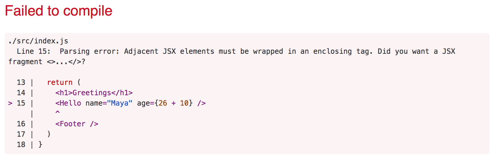

> Fullstack &#9656; [Parte 1](./part1.md) &#9656; Introducción a React

<details><summary>a Introducción a React</summary>

&#9656; [Componente](#componente)

&#9656; [JSX](#JSX)

&#9656; [Componentes mútiples](#Componentes-mútiples)

&#9656; [props: pasar datos a componentes](#props-pasar-datos-a-componentes)

&#9656; [Ejercicios 1.1.-1.2.](#Ejercicios-1.1.-1.2.)

</details>

&#9656; [b JavaScript](./part1b.md)

&#9656; [c Estado del componente, controladores de eventos](./part1c.md)

&#9656; [d Un estado más complejo, depurando aplicaciones React](./part1d.md)

# Ⓐ Introducción a React

Ahora comenzaremos a familiarizarnos con probablemente el tema más importante de este curso, es decir, la librería [React](https://es.reactjs.org/). Comencemos con la creación de una aplicación React simple y con el conocimiento de los conceptos básicos de React.

La forma más fácil de empezar es utilizando una herramienta llamada [create-react-app](https://github.com/facebook/create-react-app). Es posible (pero no necesario) instalar _create-react-app_ en su máquina si la herramienta _npm_ que se instaló junto con Node tiene un número de versión de al menos _5.3_.

Creemos una aplicación llamada _part1_ y naveguemos hasta su directorio.

```bash
$ npx create-react-app part1
$ cd part1
```

Cada comando, aquí y en el futuro, comenzando con el carácter _$_ se escribe en una terminal prompt, también conocido como interfaz de línea de comandos. El carácter _$_ no se debe escribir porque representa el mensaje.

La aplicación se ejecuta de la siguiente manera:

```bash
$ npm start
```

De forma predeterminada, la aplicación se ejecuta en el puerto localhost 3000 con la dirección <http://localhost:3000>.

Chrome debería iniciarse automáticamente. Abra la consola del navegador **inmediatamente**. También abra un editor de texto para que pueda ver el código y la página web al mismo tiempo en la pantalla:


El código de la aplicación reside en la carpeta _src_. Simplifiquemos el código predeterminado de modo que el contenido del archivo _index.js_ se vea así:

```js
import React from 'react'
import ReactDOM from 'react-dom'

const App = () => (
  <div>
    <p>Hello world</p> 
  </div>
)

ReactDOM.render(<App />, document.getElementById('root'))
```

Los archivos _App.js_, _App.css_, _App.test.js_, _logo.svg_, _setupTests.js_ y _reportWebVitals.js_ pueden eliminarse ya que no son necesarios en nuestra aplicación en este momento.

## Componente

El archivo _index.js_ ahora define un [componente](https://es.reactjs.org/docs/components-and-props.html) de React con el nombre _App_ y el comando en la línea final

```js
ReactDOM.render(<App />, document.getElementById('root'))
```

renderiza su contenido en el elemento _div_, definido en el archivo _public/index.html_, que tiene el valor de _id_ 'root'.

De forma predeterminada, el archivo _public/index.html_ no contiene ningún marcado HTML que sea visible para nosotros en el navegador. Puede intentar agregar algo de HTML al archivo. Sin embargo, cuando se usa React, todo el contenido que debe procesarse generalmente se define como componentes de React.

Echemos un vistazo más de cerca al código que define el componente:

```js
const App = () => (
  <div>
    <p>Hello world</p>
  </div>
)
```

Como probablemente adivinaste, el componente se representará como una etiqueta _div_, que envuelve una etiqueta _p_ que contiene el texto _Hello world_.

Técnicamente, el componente se define como una función de JavaScript. La siguiente es una función (que no recibe ningún parámetro):

```js
() => (
  <div>
    <p>Hello world</p>
  </div>
)
```

La función luego se asigna a un variable constante _App_:

```js
const App = ...
```

Hay algunas formas de definir funciones en JavaScript. Aquí utilizaremos [funciones de flecha](https://developer.mozilla.org/es/docs/Web/JavaScript/Referencia/Funciones/Arrow_functions), que se describen en una versión más reciente de JavaScript conocida como [ECMAScript 6](http://es6-features.org/#Constants), también llamada ES6.

Debido a que la función consta de una sola expresión, hemos utilizado una abreviatura, que representa este fragmento de código:

```js
const App = () => {
  return (
    <div>
      <p>Hello world</p>
    </div>
  )
}
```

En otras palabras, la función devuelve el valor de la expresión.

La función que define el componente puede contener cualquier tipo de código JavaScript. Modifique su componente para que sea de la siguiente manera y observe lo que sucede en la consola:

```js
const App = () => {
  console.log('Hello from component')
  return (
    <div>
      <p>Hello world</p>
    </div>
  )
}
```

También es posible renderizar contenido dinámico dentro de un componente.

Modifique el componente de la siguiente manera:

```js
const App = () => {
  const now = new Date()
  const a = 10
  const b = 20

  return (
    <div>
      <p>Hello world, it is {now.toString()}</p>
      <p>
        {a} plus {b} is {a + b}
      </p>
    </div>
  )
}
```

Se evalúa cualquier código JavaScript entre llaves y el resultado de esta evaluación se incrusta en el lugar definido en el HTML producido por el componente.

## JSX

Parece que los componentes de React están devolviendo marcado HTML. Sin embargo, éste no es el caso. El diseño de los componentes de React se escribe principalmente usando [JSX](https://es.reactjs.org/docs/introducing-jsx.html). Aunque JSX se parece a HTML, en realidad estamos tratando con una forma de escribir JavaScript. Bajo el capó, el JSX devuelto por los componentes de React se compila en JavaScript.

Después de compilar, nuestra aplicación se ve así:

```js
import React from 'react'
import ReactDOM from 'react-dom'

const App = () => {
  const now = new Date()
  const a = 10
  const b = 20
  return React.createElement(
    'div',
    null,
    React.createElement(
      'p', null, 'Hello world, it is ', now.toString()
    ),
    React.createElement(
      'p', null, a, ' plus ', b, ' is ', a + b
    )
  )
}

ReactDOM.render(
  React.createElement(App, null),
  document.getElementById('root')
)
```

La compilación está a cargo de [Babel](https://babeljs.io/repl/). Los proyectos creados con *create-react-app* están configurados para compilarse automáticamente. Aprenderemos más sobre este tema en la [parte 7](../../7/es/part7.md) de este curso.

También es posible escribir React como "JavaScript puro" sin usar JSX. Aunque, nadie con una mente sana lo haría realmente.

En la práctica, JSX se parece mucho a HTML con la distinción de que con JSX puede incrustar fácilmente contenido dinámico escribiendo JavaScript apropiado entre llaves. La idea de JSX es bastante similar a muchos lenguajes de plantillas, como Thymeleaf, que se utiliza junto con Java Spring, que se utiliza en servidores.

JSX es similar a [XML](https://developer.mozilla.org/es/docs/Web/XML/Introducci%C3%B3n_a_XML), lo que significa que todas las etiquetas deben cerrarse. Por ejemplo, una nueva línea es un elemento vacío, que en HTML se puede escribir de la siguiente manera:

```html
<br>
```

pero al escribir JSX, la etiqueta debe estar cerrada: 

```html
<br />
```

## Componentes mútiples

Modifiquemos la aplicación de la siguiente manera (NB: las importaciones en la parte superior del archivo se omiten en estos _ejemplos_, ahora y en el futuro. Todavía son necesarias para que el código funcione):

```js
// highlight-start
const Hello = () => {
  return (
    <div>
      <p>Hello world</p>
    </div>
  )
}
// highlight-end

const App = () => {
  return (
    <div>
      <h1>Greetings</h1>
      <Hello /> // highlight-line
    </div>
  )
}

ReactDOM.render(<App />, document.getElementById('root'))
```

Hemos definido un nuevo componente _Hello_ y lo usamos dentro del componente _App_. Naturalmente, un componente se puede usar múltiples veces:

```js
const App = () => {
  return (
    <div>
      <h1>Greetings</h1>
      <Hello />
      // highlight-start
      <Hello />
      <Hello />
      // highlight-end
    </div>
  )
}
```

Escribir componentes con React es fácil, y al combinar componentes, incluso una aplicación más compleja puede conservarse bastante fácil de mantener. De hecho, una filosofía central de React es componer aplicaciones a partir de muchos componentes reutilizables especializados.

Otra fuerte convención es la idea de un _componente raíz_ llamado _App_ en la parte superior del árbol de componentes de la aplicación. Sin embargo, como aprenderemos en la [parte 6](../../6/es/part6.md), hay situaciones en las que el componente _App_ no es exactamente la raíz, sino que está incluido en un componente de utilidad apropiado.

## props: pasar datos a componentes

Es posible pasar datos a componentes usando los llamados [props](https://es.reactjs.org/docs/components-and-props.html).

Modifiquemos el componente _Hello_ de la siguiente manera:

```js
const Hello = (props) => { // highlight-line
  return (
    <div>
      <p>Hello {props.name}</p> // highlight-line
    </div>
  )
}
```

Ahora la función que define el componente tiene un parámetro _props_. Como argumento, el parámetro recibe un objeto, que tiene campos correspondientes a todos los "props" ("accesorios") que el usuario del componente define.

Los props se definen de la siguiente manera:

```js
const App = () => {
  return (
    <div>
      <h1>Greetings</h1>
      <Hello name="George" /> // highlight-line
      <Hello name="Daisy" /> // highlight-line
    </div>
  )
}
```

Puede haber un número arbitrario de props y sus valores pueden ser strings "incrustados en el código" ("hard coded") o resultados de expresiones JavaScript. Si el valor del prop se logra usando JavaScript, debe estar envuelto con llaves. 

Modifiquemos el código para que el componente _Hello_ use dos props:

```js
const Hello = (props) => {
  return (
    <div>
      <p>
        Hello {props.name}, you are {props.age} years old // highlight-line
      </p>
    </div>
  )
}

const App = () => {
  const name = 'Peter' // highlight-line
  const age = 10       // highlight-line

  return (
    <div>
      <h1>Greetings</h1>
      <Hello name="Maya" age={26 + 10} /> // highlight-line
      <Hello name={name} age={age} />     // highlight-line
    </div>
  )
}
```

Los props enviados por el componente _App_ son los valores de las variables, el resultado de la evaluación de la expresión suma y un string regular.

### Algunas notas

React se ha configurado para generar mensajes de error bastante claros. A pesar de esto, debe, al menos al principio, avanzar en **pasos muy pequeños** y asegurarse de que cada cambio funcione como se desea.

**La consola siempre debe estar abierta**. Si el navegador reporta errores, no es recomendable seguir escribiendo más código, esperando milagros. En su lugar, debe intentar comprender la causa del error y, por ejemplo, volver al estado de trabajo anterior:


Es bueno recordar que en React es posible y vale la pena escribir comandos _console.log()_ (que se imprimen en la consola) dentro de tu código. 

También tenga en cuenta que **los nombres de los componentes de React deben estar en mayúscula**. Si intenta definir un componente de la siguiente manera

```js
const footer = () => {
  return (
    <div>
      greeting app created by <a href="https://github.com/mluukkai">mluukkai</a>
    </div>
  )
}
```

y usarlo así

```js
const App = () => {
  return (
    <div>
      <h1>Greetings</h1>
      <Hello name="Maya" age={26 + 10} />
      <footer /> // highlight-line
    </div>
  )
}
```

la página no mostrará el contenido definido dentro del componente Footer, y en su lugar React solo crea un elemento _footer_ vacío. Si cambia la primera letra del nombre del componente a una letra mayúscula, React crea un elemento _div_ definido en el componente Footer, que se representa en la página.

Tenga en cuenta que el contenido de un componente de React (normalmente) debe contener **un elemento raíz**. Si, por ejemplo, intentamos definir el componente _App_ sin el elemento _div_ más externo:

```js
const App = () => {
  return (
    <h1>Greetings</h1>
    <Hello name="Maya" age={26 + 10} />
    <Footer />
  )
}
```

el resultado es un mensaje de error.



Usar un elemento raíz no es la única opción de trabajo. Un _array_ de componentes también es una solución válida:

```js
const App = () => {
  return [
    <h1>Greetings</h1>,
    <Hello name="Maya" age={26 + 10} />,
    <Footer />
  ]
}
```

Sin embargo, al definir el componente raíz de la aplicación, esto no es algo particularmente inteligente y hace que el código se vea un poco desagradable.

Debido a que el elemento raíz está estipulado, tenemos elementos div "extra" en el árbol DOM. Esto se puede evitar usando [fragments](https://es.reactjs.org/docs/fragments.html), es decir, envolviendo los elementos que el componente devolverá con un elemento vacío:

```js
const App = () => {
  const name = 'Peter'
  const age = 10

  return (
    <>
      <h1>Greetings</h1>
      <Hello name="Maya" age={26 + 10} />
      <Hello name={name} age={age} />
      <Footer />
    </>
  )
}
```

Ahora se compila con éxito y el DOM generado por React ya no contiene el elemento div adicional.

## Ejercicios 1.1.-1.2.

Los ejercicios se envían a través de GitHub y marcando los ejercicios completados en la [solicitud de envío](https://studies.cs.helsinki.fi/stats/courses/fullstackopen).

Puede enviar todos los ejercicios de este curso al mismo repositorio o utilizar varios repositorios. Si envía ejercicios de diferentes partes en el mismo repositorio, utilice un esquema de nomenclatura razonable para los directorios.

Una estructura de archivos muy funcional para el repositorio de envíos es la siguiente:

```
part0
part1
  courseinfo
  unicafe
  anecdotes
part2
  phonebook
  countries
```

Vea [esto](https://github.com/fullstack-hy2020/example-submission-repository)! 

Para cada parte del curso hay un directorio, que se ramifica en directorios que contienen una serie de ejercicios, como "unicafe" para la parte 1.

Por cada aplicación web para una serie de ejercicios, se recomienda enviar todos los archivos relacionados con esa aplicación, excepto para el directorio _node_modules_.

Los ejercicios se envían **una parte a la vez**. Cuando haya enviado los ejercicios para una parte del curso, ya no podrá enviar ejercicios incompletos para la misma parte.

Tenga en cuenta que en esta parte, hay más ejercicios además de los que se encuentran a continuación. _No envíe su trabajo_ hasta que haya completado todos los ejercicios que desea enviar para la parte.

### 1.1: información del curso, paso 1

_La aplicación en la que comenzaremos a trabajar en este ejercicio se desarrollará más a fondo en algunos de los siguientes ejercicios. En este y otros conjuntos de ejercicios futuros de este curso, es suficiente enviar solo el estado final de la aplicación. Si lo desea, también puede crear un commit para cada ejercicio de la serie, pero esto es completamente opcional._

Use create-react-app para inicializar una nueva aplicación. Modifique _index.js_ para que coincida con el siguiente código

```js
import React from 'react'
import ReactDOM from 'react-dom'

const App = () => {
  const course = 'Half Stack application development'
  const part1 = 'Fundamentals of React'
  const exercises1 = 10
  const part2 = 'Using props to pass data'
  const exercises2 = 7
  const part3 = 'State of a component'
  const exercises3 = 14

  return (
    <div>
      <h1>{course}</h1>
      <p>
        {part1} {exercises1}
      </p>
      <p>
        {part2} {exercises2}
      </p>
      <p>
        {part3} {exercises3}
      </p>
      <p>Number of exercises {exercises1 + exercises2 + exercises3}</p>
    </div>
  )
}

ReactDOM.render(<App />, document.getElementById('root'))
```

y elimine los archivos adicionales (App.js, App.css, App.test.js, logo.svg, setupTests.js, reportWebVitals.js).

Desafortunadamente, toda la aplicación está en el mismo componente. Refactorice el código para que conste de tres componentes nuevos: _Header_, _Content_ y _Total_. Todos los datos aún residen en el componente _App_, que pasa los datos necesarios a cada componente mediante _props_. _Header_ se encarga de representar el nombre del curso, _Content_ representa las partes y su número de ejercicios y _Total_ representa el número total de ejercicios.

El cuerpo del componente _App_ será aproximadamente como sigue:

```js
const App = () => {
  // const-definitions

  return (
    <div>
      <Header course={course} />
      <Content ... />
      <Total ... />
    </div>
  )
}
```

**ADVERTENCIA** create-react-app convierte automáticamente el proyecto en un repositorio de git a menos que la aplicación se cree dentro de un repositorio ya existente. Lo más probable es que **no quieras** que el proyecto se convierta en un repositorio, así que ejecuta el comando _rm -rf .git_ en la raíz del proyecto.

### 1.2: información del curso, paso 2

Refactorice el componente _Content_ para que no represente ningún nombre de partes o su número de ejercicios por sí mismo. En su lugar, solo representa tres componentes _Part_ de los cuales cada uno representa el nombre y el número de ejercicios de una parte.

```js
const Content = ... {
  return (
    <div>
      <Part .../>
      <Part .../>
      <Part .../>
    </div>
  )
}
```

Nuestra aplicación pasa información de una manera bastante primitiva en este momento, ya que se basa en variables individuales. Esta situación mejorará pronto.

---

<div align="center">

[Proponer cambios en el material](https://github.com/sebastiantorres86/Fullstack-Spanish/edit/main/src/content/1/es/part1a.md)

</div>

<div align="right">
  <a href="../../1/es/part1b.md">Parte 1b<br>Siguiente parte</a>
</div>