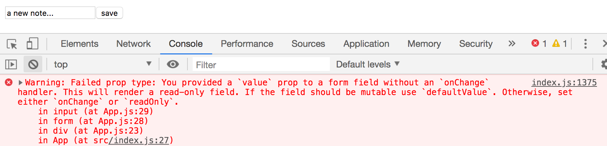
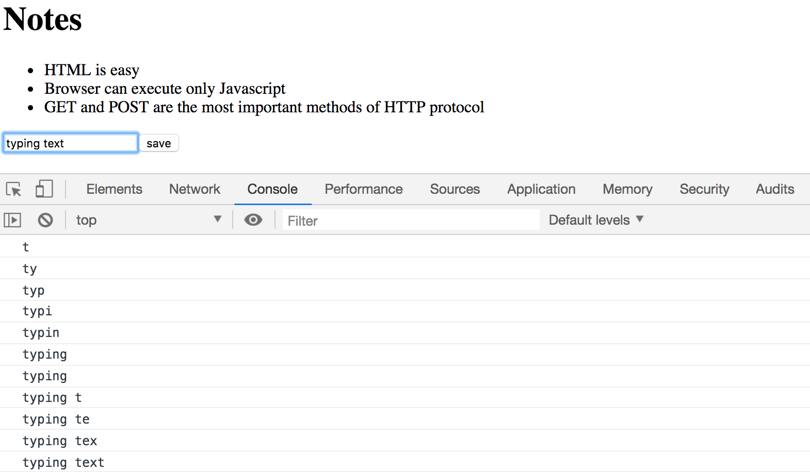
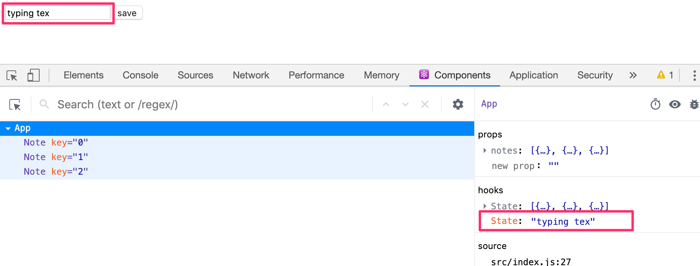
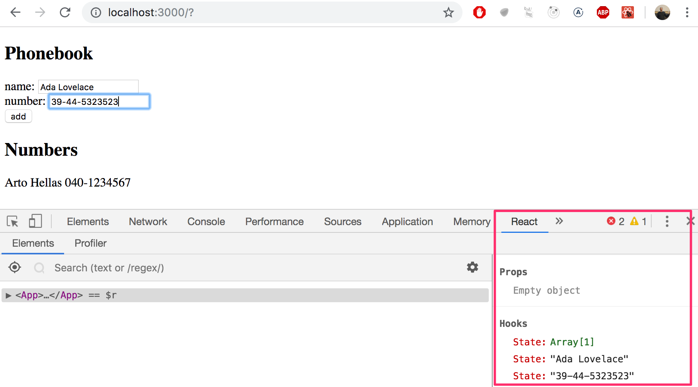

> Fullstack &#9656; [Parte 2](./part2.md) &#9656; Formularios

&#9656; [a Renderizando una colección, módulos](./part2a.md)

<details><summary>b Formularios</summary>

&#9656; [Filtrado de elementos mostrados](#Filtrado-de-elementos-mostrados)

&#9656; [Ejercicios 2.6.-2.10.](#Ejercicios-2.6.-2.10.)

</details>

&#9656; [c Obteniendo datos del servidor](./part2c.md)

&#9656; [d Alterando datos en el servidor](./part2d.md)

&#9656; [e Agregando estilos a la aplicación React](./part2emd)

# ⓑ Formularios

Continuemos expandiendo nuestra aplicación permitiendo a los usuarios agregar nuevas notas.

Para que nuestra página se actualice cuando se agregan nuevas notas, es mejor almacenar las notas en el estado del componente _App_. Importemos la función [useState](https://es.reactjs.org/docs/hooks-state.html) y usémosla para definir una parte del estado que se inicializa con la matriz de notas inicial pasada en los props.

```js
import React, { useState } from 'react' // highlight-line
import Note from './components/Note'

const App = (props) => { // highlight-line
  const [notes, setNotes] = useState(props.notes) // highlight-line

  return (
    <div>
      <h1>Notes</h1>
      <ul>
        {notes.map(note => 
          <Note key={note.id} note={note} />
        )}
      </ul>
    </div>
  )
}

export default App
```

El componente usa la función _useState_ para inicializar la parte de estado almacenada en _notes_ con la matriz de notas pasadas en los props:

```js
const App = (props) => { 
  const [notes, setNotes] = useState(props.notes) 

  // ...
}
```

Si quisiéramos comenzar con una lista vacía de notas, estableceríamos el valor inicial como una matriz vacía, y dado que los props no se usarían, podríamos omitir el parámetro _props_ de la definición de la función:

```js
const App = () => {
  const [notes, setNotes] = useState([])

  // ...
}
```

Sigamos con el valor inicial pasado en los props por el momento.

A continuación, agreguemos un [formulario](https://developer.mozilla.org/es/docs/Learn/Forms) HTML al componente que se utilizará para agregar nuevas notas.

```js
const App = (props) => {
  const [notes, setNotes] = useState(props.notes)

// highlight-start
  const addNote = (event) => {
    event.preventDefault()
    console.log('button clicked', event.target)
  }
  // highlight-end

  return (
    <div>
      <h1>Notes</h1>
      <ul>
        {notes.map(note => 
          <Note key={note.id} note={note} />
        )}
      </ul>
      // highlight-start
      <form onSubmit={addNote}>
        <input />
        <button type="submit">save</button>
      </form>
      // highlight-end
    </div>
  )
}
```

Hemos agregado la función _addNote_ como un controlador de eventos al elemento del formulario que se llamará cuando se envíe el formulario, haciendo clic en el botón submit.

Usamos el método discutido en la [parte 1](../../1/es/part1c.md#Manejo-de-eventos) para definir nuestro controlador de eventos:

```js
const addNote = (event) => {
  event.preventDefault()
  console.log('button clicked', event.target)
}
```

El parámetro _event_ es el [evento](https://es.reactjs.org/docs/handling-events.html) que activa la llamada a la función del controlador de eventos:

El controlador de eventos llama inmediatamente al método _event.preventDefault()_, que evita la acción predeterminada de enviar un formulario. La acción predeterminada, entre otras cosas, haría que la página se recargara.

El objetivo del evento almacenado en _event.target_ se registra en la consola:


El objetivo (target) en este caso es el formulario que hemos definido en nuestro componente.

¿Cómo accedemos a los datos contenidos en el elemento _input_ del formulario?

Hay muchas maneras de lograr esto; el primer método que veremos es mediante el uso de los llamados [componentes controlados](https://es.reactjs.org/docs/forms.html#controlled-components).

Agreguemos un nuevo estado llamado _newNote_ para almacenar la entrada enviada por el usuario **y** configurémoslo como el atributo _value_ del elemento _input_:

```js
const App = (props) => {
  const [notes, setNotes] = useState(props.notes)
  // highlight-start
  const [newNote, setNewNote] = useState(
    'a new note...'
  ) 
  // highlight-end

  const addNote = (event) => {
    event.preventDefault()
    console.log('button clicked', event.target)
  }

  return (
    <div>
      <h1>Notes</h1>
      <ul>
        {notes.map(note => 
          <Note key={note.id} note={note} />
        )}
      </ul>
      <form onSubmit={addNote}>
        <input value={newNote} /> //highlight-line
        <button type="submit">save</button>
      </form>
    </div>
  )
}
```

El texto del marcador de posición almacenado como valor inicial del estado _newNote_ aparece en el elemento _input_, pero el texto de entrada no se puede editar. La consola muestra una advertencia que nos da una pista de lo que podría estar mal:



Dado que asignamos una parte del estado del componente _App_ como el atributo _value_ del elemento de entrada, el componente _App_ ahora [controla](https://es.reactjs.org/docs/forms.html#controlled-components) el comportamiento del elemento de entrada.

Para habilitar la edición del elemento de entrada, tenemos que registrar un _controlador de eventos_ que sincronice los cambios realizados en la entrada con el estado del componente:

```js
const App = (props) => {
  const [notes, setNotes] = useState(props.notes)
  const [newNote, setNewNote] = useState(
    'a new note...'
  )

  // ...

// highlight-start
  const handleNoteChange = (event) => {
    console.log(event.target.value)
    setNewNote(event.target.value)
  }
// highlight-end

  return (
    <div>
      <h1>Notes</h1>
      <ul>
        {notes.map(note => 
          <Note key={note.id} note={note} />
        )}
      </ul>
      <form onSubmit={addNote}>
        <input
          value={newNote}
          onChange={handleNoteChange} // highlight-line
        />
        <button type="submit">save</button>
      </form>
    </div>
  )
}
```

Ahora hemos registrado un controlador de eventos en el atributo _onChange_ del elemento _input_ del formulario:

```js
const handleNoteChange = (event) => {
  console.log(event.target.value)
  setNewNote(event.target.value)
}
```

Se llama al controlador de eventos cada vez que _ocurre un cambio en el elemento de entrada_. La función del controlador de eventos recibe el objeto de evento como su parámetro _event_:

```js
const handleNoteChange = (event) => {
  console.log(event.target.value)
  setNewNote(event.target.value)
}
```

La propiedad _target_ del objeto de evento ahora corresponde al elemento _input_ controlado y _event.target.value_ se refiere al valor de entrada de ese elemento.

Tenga en cuenta que no necesitamos llamar al método _event.preventDefault()_ como hicimos en el controlador de eventos _onSubmit_. Esto se debe a que no se produce una acción predeterminada en un cambio de entrada, a diferencia de lo que ocurre con el envío de un formulario.

Puede seguir en la consola para ver cómo se llama el controlador de eventos:



Se acordó de instalar [React devtools](https://chrome.google.com/webstore/detail/react-developer-tools/fmkadmapgofadopljbjfkapdkoienihi), ¿verdad? Bueno. Puede ver directamente cómo cambia el estado desde la pestaña React Devtools:



Ahora el estado del componente _newNote_ de _App_ refleja el valor actual de la entrada, lo que significa que podemos completar la función _addNote_ para crear nuevas notas:

```js
const addNote = (event) => {
  event.preventDefault()
  const noteObject = {
    content: newNote,
    date: new Date().toISOString(),
    important: Math.random() < 0.5,
    id: notes.length + 1,
  }

  setNotes(notes.concat(noteObject))
  setNewNote('')
}
```

Primero creamos un nuevo objeto para la nota llamado _noteObject_ que recibirá su contenido del estado del componente _newNote_. El identificador único _id_ se genera en función del número total de notas. Este método funciona para nuestra aplicación ya que las notas nunca se eliminan. Con la ayuda de la función _Math.random()_, nuestra nota tiene un 50% de posibilidades de ser marcada como importante.

La nueva nota se agrega a la lista de notas usando el método de matriz [concat](https://developer.mozilla.org/es/docs/Web/JavaScript/Reference/Global_Objects/Array/concat), introducido en la [parte 1](../../1/es/part1b.md#arrays):

```js
setNotes(notes.concat(noteObject))
```

El método no muta la matriz _notes_ original, sino que crea _una nueva copia de la matriz con el nuevo elemento agregado al final_. Esto es importante ya que [nunca debemos mutar el estado directamente](https://es.reactjs.org/docs/state-and-lifecycle.html#using-state-correctly) en React!

El controlador de eventos también restablece el valor del elemento de entrada controlado llamando a la función <em>setNewNote</em> del estado de <em>newNote</em>:

```js
setNewNote('')
```

Puede encontrar el código para nuestra aplicación actual en su totalidad en la rama _part2-2_ de [este repositorio de GitHub](https://github.com/fullstack-hy2020/part2-notes/tree/part2-2).

## Filtrado de elementos mostrados

Agreguemos una nueva funcionalidad a nuestra aplicación que nos permite ver solo las notas importantes.

Agreguemos un fragmento de estado al componente _App_ que realiza un seguimiento de las notas que deben mostrarse:

```js
const App = (props) => {
  const [notes, setNotes] = useState(props.notes)
  const [newNote, setNewNote] = useState('')
  const [showAll, setShowAll] = useState(true) // highlight-line

  // ...
}
```

Cambiemos el componente para que almacene una lista de todas las notas que se mostrarán en la variable _notesToShow_. Los elementos de la lista dependen del estado del componente:

```js
import React, { useState } from 'react'
import Note from './components/Note'

const App = (props) => {
  const [notes, setNotes] = useState(props.notes)
  const [newNote, setNewNote] = useState('') 
  const [showAll, setShowAll] = useState(true)

  // ...

// highlight-start
  const notesToShow = showAll
    ? notes
    : notes.filter(note => note.important === true)
// highlight-end

  return (
    <div>
      <h1>Notes</h1>
      <ul>
        {notesToShow.map(note => // highlight-line
          <Note key={note.id} note={note} />
        )}
      </ul>
      // ...
    </div>
  )
}
```

La definición de la variable _notesToShow_ es bastante compacta:

```js
const notesToShow = showAll
  ? notes
  : notes.filter(note => note.important === true)
```

La definición usa el operador [condicional](https://developer.mozilla.org/es/docs/Web/JavaScript/Reference/Operators/Conditional_Operator) que también se encuentra en muchos otros lenguajes de programación.

El operador funciona de la siguiente manera. Si tenemos:

```js
const result = condition ? val1 : val2
```

la variable _result_ se establecerá en el valor de _val1_ si la _condición (condition)_ es verdadera. Si la _condition_ es falsa, la variable _result_ se establecerá en el valor de _val2_.

Si el valor de _showAll_ es falso, la variable _notesToShow_ se asignará a una lista que solo contiene notas que tienen la propiedad _important_ establecida en true. El filtrado se realiza con la ayuda del método de matriz [filter](https://developer.mozilla.org/es/docs/Web/JavaScript/Reference/Global_Objects/Array/filter):

```js
notes.filter(note => note.important === true)
```

El operador de comparación es de hecho redundante, ya que el valor de _note.important_ es _true_ o _false_ lo que significa que simplemente podemos escribir:

```js
notes.filter(note => note.important)
```

La razón por la que mostramos el operador de comparación primero fue para enfatizar un detalle importante: en JavaScript _val1 == val2_ no funciona como se esperaba en todas las situaciones y es más seguro utilizar _val1 === val2_ exclusivamente en las comparaciones. Puede leer más sobre el tema [aquí](https://developer.mozilla.org/es/docs/Web/JavaScript/Equality_comparisons_and_sameness).

Puede probar la funcionalidad de filtrado cambiando el valor inicial del estado _showAll_.

A continuación, agreguemos una funcionalidad que permita a los usuarios alternar el estado _showAll_ de la aplicación desde la interfaz de usuario.

Los cambios relevantes se muestran a continuación:

```js
import React, { useState } from 'react'
import Note from './components/Note'

const App = (props) => {
  const [notes, setNotes] = useState(props.notes) 
  const [newNote, setNewNote] = useState('')
  const [showAll, setShowAll] = useState(true)

  // ...

  return (
    <div>
      <h1>Notes</h1>
// highlight-start
      <div>
        <button onClick={() => setShowAll(!showAll)}>
          show {showAll ? 'important' : 'all' }
        </button>
      </div>
// highlight-end
      <ul>
        {notesToShow.map(note =>
          <Note key={note.id} note={note} />
        )}
      </ul>
      // ...
    </div>
  )
}
```

Las notas mostradas (todas versus las importantes) se controlan con un botón. El controlador de eventos para el botón es tan simple que se ha definido directamente en el atributo del elemento del botón. El controlador de eventos cambia el valor de _showAll_ de verdadero a falso y viceversa:

```js
() => setShowAll(!showAll)
```

El texto del botón depende del valor del estado de _showAll_:

```js
show {showAll ? 'important' : 'all'}
```

Puede encontrar el código para nuestra aplicación actual en su totalidad en la rama _part2-3_ de [este repositorio de GitHub](https://github.com/fullstack-hy2020/part2-notes/árbol/part2-3).

## Ejercicios 2.6.-2.10.

En el primer ejercicio, comenzaremos a trabajar en una aplicación que se desarrollará más en los ejercicios posteriores. En conjuntos de ejercicios relacionados, es suficiente devolver la versión final de su aplicación. También puede realizar una confirmación por separado después de haber terminado cada parte del conjunto de ejercicios, pero no es necesario hacerlo.

**ADVERTENCIA** create-react-app convertirá automáticamente su proyecto en un repositorio git a menos que cree su aplicación dentro de un repositorio git existente. Es probable que **no desee** que su proyecto sea un repositorio, así que simplemente ejecute el comando _rm -rf .git_ en la raíz de su aplicación.

### 2.6: La guía telefónica, paso 1

Creemos una guía telefónica simple. ***En esta parte solo agregaremos nombres a la agenda.***

Comencemos por implementar la adición de una persona a la agenda.

Puede utilizar el siguiente código como punto de partida para el componente _App_ de su aplicación:

```js
import React, { useState } from 'react'

const App = () => {
  const [ persons, setPersons ] = useState([
    { name: 'Arto Hellas' }
  ]) 
  const [ newName, setNewName ] = useState('')

  return (
    <div>
      <h2>Phonebook</h2>
      <form>
        <div>
          name: <input />
        </div>
        <div>
          <button type="submit">add</button>
        </div>
      </form>
      <h2>Numbers</h2>
      ...
    </div>
  )
}

export default App
```

El estado de _newName_ está destinado a controlar el elemento de entrada del formulario.

A veces puede resultar útil representar el estado y otras variables como texto con fines de depuración. Puede agregar temporalmente el siguiente elemento al componente renderizado:

```
<div>debug: {newName}</div>
```

También es importante poner lo que aprendimos en el capítulo [depuración de aplicaciones React](../../1/es/part1d.md#Depuracion-de-aplicaciones-React) de la parte uno en buen uso. La extensión [React developer tools](https://chrome.google.com/webstore/detail/react-developer-tools/fmkadmapgofadopljbjfkapdkoienihi) especialmente, es increíblemente útil para rastrear los cambios que ocurren en el estado de la aplicación.

Después de terminar este ejercicio, su aplicación debería verse así:


¡Tenga en cuenta el uso de la extensión de herramientas de desarrollo React en la imagen de arriba!

**NB:**

- puede utilizar el nombre de la persona como valor de la propiedad _key_
- ¡recuerde evitar la acción predeterminada de enviar formularios HTML!

### 2.7: La guía telefónica, paso 2

Evita que el usuario pueda agregar nombres que ya existen en el directorio telefónico. Los arreglos de JavaScript tienen numerosos [métodos](https://developer.mozilla.org/es/docs/Web/JavaScript/Reference/Global_Objects/Array) adecuados para realizar esta tarea.

Emita una advertencia con el comando [alert](https://developer.mozilla.org/es/docs/Web/API/Window/alert) cuando se intente realizar una acción de este tipo:


**Sugerencia:** cuando está formando cadenas que contienen valores de variables, se recomienda utilizar una [plantilla de cadena](https://developer.mozilla.org/es/docs/Web/JavaScript/Reference/Template_literals):


```js
`${newName} is already added to phonebook`
```

Si la variable _newName_ tiene el valor _Arto Hellas_, la expresión de la plantilla de cadena regresa la cadena

```js
`Arto Hellas is already added to phonebook`
```

Lo mismo se podría hacer en una forma más similar a Java usando el operador más:

```js
newName + ' is already added to phonebook'
```

Usar plantillas de cadenas es la opción más idiomática y el signo de un verdadero profesional de JavaScript.

### 2.8: La guía telefónica, paso 3

Amplíe su aplicación permitiendo a los usuarios agregar números de teléfono a la guía telefónica. Deberá agregar un segundo elemento _input_ al formulario (junto con su propio controlador de eventos):

```js
<form>
  <div>name: <input /></div>
  <div>number: <input /></div>
  <div><button type="submit">add</button></div>
</form>
```

En este punto, la aplicación podría verse así. La imagen también muestra el estado de la aplicación con la ayuda de [React developer tools](https://chrome.google.com/webstore/detail/react-developer-tools/fmkadmapgofadopljbjfkapdkoienihi):



Implemente un campo de búsqueda que pueda usarse para filtrar la lista de personas por nombre:


Puede implementar el campo de búsqueda como un elemento _input_ que se coloca fuera del formulario HTML. La lógica de filtrado que se muestra en la imagen _no distingue entre mayúsculas y minúsculas_, lo que significa que el término de búsqueda _arto_ también devuelve resultados que contienen Arto con una A mayúscula.

**NB:** Cuando están trabajando en una nueva funcionalidad, a menudo es útil "codificar" algunos datos ficticios en su aplicación, por ejemplo

```js
const App = () => {
  const [persons, setPersons] = useState([
    { name: 'Arto Hellas', number: '040-123456' },
    { name: 'Ada Lovelace', number: '39-44-5323523' },
    { name: 'Dan Abramov', number: '12-43-234345' },
    { name: 'Mary Poppendieck', number: '39-23-6423122' }
  ])

  // ...
}
```

Esto evita tener que ingresar datos manualmente en su aplicación para probar su nueva funcionalidad.

### 2.10: La guía telefónica, paso 5

Si ha implementado su aplicación en un solo componente, refactorice extrayendo las partes adecuadas en nuevos componentes. Mantenga el estado de la aplicación y todos los controladores de eventos en el componente raíz de _App_.

Es suficiente extraer ***tres*** componentes de la aplicación. Buenos candidatos para componentes separados son, por ejemplo, el filtro de búsqueda, el formulario para agregar nuevas personas a la agenda telefónica, un componente que muestra a todas las personas de la agenda telefónica y un componente que muestra los detalles de una sola persona.

El componente raíz de la aplicación podría verse similar a esto después de la refactorización. El componente raíz refactorizado a continuación solo representa los títulos y permite que los componentes extraídos se encarguen del resto.

```js
const App = () => {
  // ...

  return (
    <div>
      <h2>Phonebook</h2>

      <Filter ... />

      <h3>Add a new</h3>

      <PersonForm 
        ...
      />

      <h3>Numbers</h3>

      <Persons ... />
    </div>
  )
}
```

**NB**: Es posible que tenga problemas en este ejercicio si define sus componentes "en el lugar equivocado". Ahora sería un buen momento para ensayar 
el capítulo [no defina un componente en otro componente](../../1/es/part1d.md#No-definir-componentes-dentro-de-los-componentes)
de la última parte.

---

<div align="center">

[Proponer cambios en el material](https://github.com/sebastiantorres86/Fullstack-Spanish/edit/main/src/content/2/es/part2b.md)

</div>

<div align="right">
  <a href="../../2/es/part2c.md">Parte 2c<br>Siguiente parte</a>
</div>