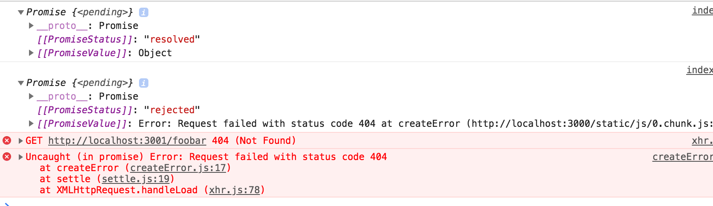

> Fullstack &#9656; [Parte 2](./part2.md) &#9656; Obteniendo datos del servidor

&#9656; [a Renderizando una colección, módulos](./part2a.md)

&#9656; [b Formularios](./part2b.md)

<details><summary>c Obteniendo datos del servidor</summary>

&#9656; [El navegador como entorno de ejecución](#El-navegador-como-entorno-de-ejecución)

&#9656; [npm](#npm)

&#9656; [Axios y promesas](#Axios-y-promesas)

&#9656; [Effect-hooks](#Effect-hooks)

&#9656; [El entorno de ejecución de desarrollo](#El-entorno-de-ejecución-de-desarrollo)

&#9656; [Ejercicios 2.11.-2.14.](#Ejercicios-2.11.-2.14.)

</details>

&#9656; [d Alterando datos en el servidor](./part2d.md)

&#9656; [e Agregando estilos a la aplicación React](./part2emd)

# ⓒ Obteniendo datos del servidor

Desde hace un tiempo solo hemos estado trabajando en el "frontend", es decir, la funcionalidad del lado del cliente (navegador). Comenzaremos a trabajar en el "backend", es decir, la funcionalidad del lado del servidor en la tercera parte de este curso. No obstante, ahora daremos un paso en esa dirección familiarizándonos con cómo el código que se ejecuta en el navegador se comunica con el backend.

Usemos una herramienta diseñada para ser utilizada durante el desarrollo de software llamada [JSON Server](https://github.com/typicode/json-server) para que actúe como nuestro servidor.

Cree un archivo llamado _db.json_ en el directorio raíz del proyecto con el siguiente contenido:

```json
{
  "notes": [
    {
      "id": 1,
      "content": "HTML is easy",
      "date": "2019-05-30T17:30:31.098Z",
      "important": true
    },
    {
      "id": 2,
      "content": "Browser can execute only JavaScript",
      "date": "2019-05-30T18:39:34.091Z",
      "important": false
    },
    {
      "id": 3,
      "content": "GET and POST are the most important methods of HTTP protocol",
      "date": "2019-05-30T19:20:14.298Z",
      "important": true
    }
  ]
}
```

Puede [instalar](https://github.com/typicode/json-server#getting-started) el servidor JSON globalmente en su máquina usando el comando `npm install -g json-server`. Una instalación global requiere privilegios administrativos, lo que significa que no es posible en las computadoras de la facultad o en las computadoras portátiles de primer año.

Sin embargo, no es necesaria una instalación global. Desde el directorio raíz de su aplicación, podemos ejecutar _json-server_ usando el comando `npx`:

```js
npx json-server --port 3001 --watch db.json
```

_json-server_ comienza a ejecutarse en el puerto 3000 de forma predeterminada; pero dado que los proyectos se crearon usando el puerto reservado 3000 de create-react-app, debemos definir un puerto alternativo, como el puerto 3001, para el servidor json.

Naveguemos hasta la dirección <http://localhost:3001/notes> en el navegador. Podemos ver que _json-server_ sirve las notas que escribimos previamente en el archivo en formato JSON:


Si su navegador no lo hace tiene una forma de formatear la visualización de datos JSON, luego instale un complemento apropiado, por ejemplo, [JSONView](https://chrome.google.com/webstore/detail/jsonview/chklaanhfefbnpoihckbnefhakgolnmc) para hacer su vida más fácil.

De ahora en adelante, la idea será guardar las notas en el servidor, lo que en este caso significa guardarlas en el servidor json. El código de React obtiene las notas del servidor y las muestra en la pantalla. Siempre que se agrega una nueva nota a la aplicación, el código de React también la envía al servidor para que la nueva nota persista en la "memoria".

json-server almacena todos los datos en el archivo _db.json_, que reside en el servidor. En el mundo real, los datos se almacenarían en algún tipo de base de datos. Sin embargo, json-server es una herramienta útil que permite el uso de la funcionalidad del lado del servidor en la fase de desarrollo sin la necesidad de programar nada de eso.

Nos familiarizaremos con los principios de implementación de la funcionalidad del lado del servidor con más detalle en la [parte 3](../../3/es/part3.md) de este curso.

## El navegador como entorno de ejecución

Nuestra primera tarea es recuperar las notas ya existentes en nuestra aplicación React desde la dirección <http://localhost:3001/notes>.

En el [proyecto de ejemplo](../../0/es/part0b.md#Ejecucion-de-la-logica-de-la-aplicacion-en-el-navegador) ya aprendimos una manera de obtener datos de un servidor usando JavaScript. El código del ejemplo obtenía los datos mediante [XMLHttpRequest](https://developer.mozilla.org/es/docs/Web/API/XMLHttpRequest), también conocido como solicitud HTTP realizada mediante un objeto XHR. Esta es una técnica introducida en 1999, que todos los navegadores han admitido durante un buen tiempo.

Ya no se recomienda el uso de XHR, y los navegadores ya admiten ampliamente el método [fetch](https://developer.mozilla.org/es/docs/Web/API/WindowOrWorkerGlobalScope/fetch), que se basa en las llamadas [promesas (promises)](https://developer.mozilla.org/es/docs/Web/JavaScript/Reference/Global_Objects/Promise), en lugar del modelo impulsado por eventos utilizado por XHR.

Como recordatorio de la parte 0 (que de hecho se debería _recordar no usar_ sin una razón urgente), los datos se obtuvieron usando XHR de la siguiente manera:

```js
const xhttp = new XMLHttpRequest()

xhttp.onreadystatechange = function() {
  if (this.readyState == 4 && this.status == 200) {
    const data = JSON.parse(this.responseText)
    // manejar la respuesta que se guarda en datos variables
  }
}

xhttp.open('GET', '/data.json', true)
xhttp.send()
```

Justo al principio, registramos un _controlador de eventos_ en el objeto _xhttp_ que representa la solicitud HTTP, que será invocada por el tiempo de ejecución de JavaScript siempre que el estado del objeto _xhttp_ cambie. Si el cambio de estado significa que ha llegado la respuesta a la solicitud, los datos se manejan en consecuencia.

Vale la pena señalar que el código en el controlador de eventos se define antes de que la solicitud se envíe al servidor. A pesar de esto, el código dentro del controlador de eventos se ejecutará en un momento posterior. Por lo tanto, el código no se ejecuta de forma síncrona "de arriba a abajo", sino que lo hace _asincrónicamente_. JavaScript llama al controlador de eventos que se registró para la solicitud en algún momento.

Una forma síncrona de realizar solicitudes que es común en la programación Java, por ejemplo, se desarrollaría de la siguiente manera (NB, esto no es realmente un código Java que funcione):

```java
HTTPRequest request = new HTTPRequest();

String url = "https://fullstack-exampleapp.herokuapp.com/data.json";
List<Note> notes = request.get(url);

notes.forEach(m => {
  System.out.println(m.content);
});
```

En Java el código se ejecuta línea por línea y se detiene para esperar la solicitud HTTP, lo que significa esperar a que finalice el comando `request.get(...)`. Los datos devueltos por el comando, en este caso las notas, se almacenan en una variable y comenzamos a manipular los datos de la manera deseada.

Por otro lado, los motores JavaScript o los entornos de ejecución siguen el [modelo asincrónico](https://developer.mozilla.org/es/docs/Web/JavaScript/EventLoop). En principio, esto requiere que todas las [operaciones IO](https://en.wikipedia.org/wiki/Input/output) (con algunas excepciones) se ejecuten como no bloqueantes. Esto significa que la ejecución del código continúa inmediatamente después de llamar a una función IO, sin esperar a que regrese.

Cuando se completa una operación asincrónica, o más específicamente, en algún momento después de su finalización, el motor de JavaScript llama a los controladores de eventos registrados en la operación.

Actualmente, los motores de JavaScript son _de un solo subproceso_, lo que significa que no pueden ejecutar código en paralelo. Como resultado, es un requisito en la práctica utilizar un modelo sin bloqueo para ejecutar operaciones IO. De lo contrario, el navegador se "congelaría" durante, por ejemplo, la obtención de datos de un servidor.

Otra consecuencia de esta naturaleza de un solo subproceso de los motores de JavaScript es que si la ejecución de algún código lleva mucho tiempo, el navegador se atascará mientras dure la ejecución. Si agregamos el siguiente código en la parte superior de nuestra aplicación:

```js
setTimeout(() => {
  console.log('loop..')
  let i = 0
  while (i < 50000000000) {
    i++
  }
  console.log('end')
}, 5000)
```

todo funcionaría normalmente durante 5 segundos. Sin embargo, cuando se ejecuta la función definida como parámetro para `setTimeout`, el navegador se bloqueará mientras dure la ejecución del ciclo largo. Incluso la pestaña del navegador no se puede cerrar durante la ejecución del bucle, al menos no en Chrome.

Para que el navegador permanezca _receptivo_, es decir, para poder reaccionar continuamente a las operaciones del usuario con suficiente velocidad, la lógica del código debe ser tal que ningún cálculo individual pueda llevar demasiado tiempo.

Existe una gran cantidad de material adicional sobre el tema que se puede encontrar en Internet. Una presentación particularmente clara del tema es el discurso de apertura de Philip Roberts titulado [¿Que diablos es el "event loop" (bucle de eventos) de todos modos?](https://www.youtube.com/watch?v=8aGhZQkoFbQ) (está en inglés, pero cuenta con subtítulos en español).

En los navegadores actuales, es posible ejecutar código paralelo con la ayuda de los llamados [Web Workers](https://developer.mozilla.org/es/docs/Web/API/Web_Workers_API/Using_web_workers). Sin embargo, el bucle de eventos de una ventana individual del navegador solo lo maneja un [hilo único](https://medium.com/techtrument/multithreading-javascript-46156179cf9a).

## npm

Volvamos al tema de la obtención de datos del servidor.

Podríamos usar la función basada en promesas [fetch](https://developer.mozilla.org/es/docs/Web/API/WindowOrWorkerGlobalScope/fetch) mencionada anteriormente para extraer los datos del servidor. Fetch es una gran herramienta. Está estandarizado y es compatible con todos los navegadores modernos (excepto IE).

Dicho esto, usaremos la biblioteca [axios](https://github.com/axios/axios) en su lugar para la comunicación entre el navegador y el servidor. Funciona como fetch, pero es algo más agradable de usar. Otra buena razón para usar axios es que nos familiarizamos con la adición de bibliotecas externas, los llamados _paquetes npm_, a los proyectos de React.

Hoy en día, prácticamente todos los proyectos de JavaScript se definen utilizando el administrador de paquetes de node, también conocido como [npm](https://docs.npmjs.com/getting-started/what-is-npm). Los proyectos creados con create-react-app también siguen el formato npm. Un indicador claro de que un proyecto usa npm es el archivo _package.json_ ubicado en la raíz del proyecto:

```json
{
  "name": "notes",
  "version": "0.1.0",
  "private": true,
  "dependencies": {
    "@testing-library/jest-dom": "^4.2.4",
    "@testing-library/react": "^9.4.0",
    "@testing-library/user-event": "^7.2.1",
    "react": "^16.12.0",
    "react-dom": "^16.12.0",
    "react-scripts": "3.3.0"
  },
  "scripts": {
    "start": "react-scripts start",
    "build": "react-scripts build",
    "test": "react-scripts test",
    "eject": "react-scripts eject"
  },
  "eslintConfig": {
    "extends": "react-app"
  },
  "browserslist": {
    "production": [
      ">0.2%",
      "not dead",
      "not op_mini all"
    ],
    "development": [
      "last 1 chrome version",
      "last 1 firefox version",
      "last 1 safari version"
    ]
  }
}
```

En este punto, la parte de _dependencias_ es de mayor interés para nosotros ya que define qué _dependencias_, o bibliotecas externas, tiene el proyecto.

Ahora queremos usar axios. En teoría, podríamos definir la biblioteca directamente en el archivo _package.json_, pero es mejor instalarlo desde la línea de comandos.

```js
npm install axios
```

**NB los comandos de `npm` siempre deben ejecutarse en el directorio raíz del proyecto**, que es donde se puede encontrar el archivo _package.json_.

Axios ahora se incluye entre las otras dependencias:

```json
{
  "dependencies": {
    "@testing-library/jest-dom": "^4.2.4",
    "@testing-library/react": "^9.4.0",
    "@testing-library/user-event": "^7.2.1",
    "axios": "^0.19.2", // highlight-line
    "react": "^16.12.0",
    "react-dom": "^16.12.0",
    "react-scripts": "3.3.0"
  },
  // ...
}
```

Además de agregar axios a las dependencias, el comando `npm install` también _descargó_ el código de la biblioteca. Al igual que con otras dependencias, el código se puede encontrar en el directorio *node_modules* ubicado en la raíz. Como uno podría haber notado, *node_modules* contiene una buena cantidad de cosas interesantes.

Hagamos otra adición. Instale _json-server_ como una dependencia de desarrollo (solo se usa durante el desarrollo) ejecutando el comando:

```js
npm install json-server --save-dev
```

y haciendo una pequeña adición a la parte _scripts_ del archivo _package.json_:

```json
{
  // ... 
  "scripts": {
    "start": "react-scripts start",
    "build": "react-scripts build",
    "test": "react-scripts test",
    "eject": "react-scripts eject",
    "server": "json-server -p3001 --watch db.json" // highlight-line
  },
}
```

Ahora podemos convenientemente, sin definiciones de parámetros, iniciar json-server desde el directorio raíz del proyecto con el comando:

```js
npm run server
```

Nos familiarizaremos con la herramienta _npm_ en la [tercera parte del curso](../../3/es/part3.md).

**NB** El servidor json iniciado previamente debe terminarse antes de iniciar uno nuevo, de lo contrario habrá problemas:


La letra roja en el mensaje de error nos informa sobre el problema:

_Cannot bind to the port 3001. Please specify another port number either through --port argument or through the json-server.json configuration file_

_No se puede vincular al puerto 3001. Especifique otro número de puerto a través del argumento --port o mediante el archivo de configuración json-server.json)_

Como podemos ver, la aplicación no es capaz de vincularse al [puerto](https://en.wikipedia.org/wiki/Port_(computer_networking)). La razón es que el puerto 3001 ya está ocupado por el servidor json iniciado anteriormente.

Usamos el comando `npm install` dos veces, pero con ligeras diferencias:

```js
npm install axios
npm install json-server --save-dev
```

Hay una pequeña diferencia en los parámetros. _axios_ se instala como una dependencia de tiempo de ejecución de la aplicación, porque la ejecución del programa requiere la existencia de la biblioteca. Por otro lado, _json-server_ se instaló como una dependencia de desarrollo (`-- save-dev`), ya que el programa en sí no lo requiere. Se utiliza como ayuda durante el desarrollo de software. Habrá más sobre diferentes dependencias en la próxima parte del curso.

## Axios y promesas

Ahora estamos listos para usar axios. En el futuro, se asume que json-server se está ejecutando en el puerto 3001.

NB: Para ejecutar json-server y su aplicación react  simultáneamente, es posible que deba usar dos ventanas de terminal. Uno para mantener json-server en ejecución y el otro para ejecutar react-app.

La librería se puede poner en uso de la misma manera que otras librerías, por ejemplo, React, es decir, utilizando una instrucción `import` adecuada.

Agregue lo siguiente al archivo _index.js_:

```js
import axios from 'axios'

const promise = axios.get('http://localhost:3001/notes')
console.log(promise)

const promise2 = axios.get('http://localhost:3001/foobar')
console.log(promise2)
```

Si abre <http://localhost:3000> en el navegador, debe imprimirse a la consola:



El método de Axios `get` devuelve una [promesa](https://developer.mozilla.org/es/docs/Web/JavaScript/Guide/Using_promises).

La documentación del sitio de Mozilla establece lo siguiente sobre las promesas:

> _Una Promise (promesa en castellano) es un objeto que representa la terminación o el fracaso de una operación asíncrona._

En otras palabras, una promesa es un objeto que representa una operación asincrónica. Una promesa puede tener tres estados distintos:

1. La promesa está _pendiente_: significa que el valor final (uno de los dos siguientes) aún no está disponible.
2. La promesa está _cumplida_: Significa que la operación se ha completado y el valor final está disponible, que generalmente es una operación exitosa. Este estado a veces también se denomina _resuelto_.
3. La promesa es _rechazada_: Significa que un error impidió determinar el valor final, que generalmente representa una operación fallida.

La primera promesa en nuestro ejemplo es _cumplida_, que representa una solicitud `axios.get('http://localhost:3001/notes')` exitosa. La segunda, sin embargo, es _rechazada_ y la consola nos dice el motivo. Parece que estábamos intentando realizar una solicitud HTTP GET a una dirección inexistente.

Si, y cuando, queremos acceder al resultado de la operación representada por la promesa, debemos registrar un controlador de eventos en la promesa. Esto se logra usando el método `then`:

```js
const promise = axios.get('http://localhost:3001/notes')

promise.then(response => {
  console.log(response)
})
```

Se imprime lo siguiente en la consola:


El entorno de ejecución de JavaScript llama a la función de devolución de llamada registrada por el método `then` proporcionándole un objeto `response` como parámetro. El objeto `response` contiene todos los datos esenciales relacionados con la respuesta de una solicitud HTTP GET, que incluirían los _datos (data)_, el _código de estado (status code)_ y _cabeceras (headers)_.

Por lo general, no es necesario almacenar el objeto de promesa en una variable y, en cambio, es común encadenar la llamada al método `then` a la llamada al método axios, de modo que la siga directamente:

```js
axios.get('http://localhost:3001/notes').then(response => {
  const notes = response.data
  console.log(notes)
})
```

La función de devolución de llamada ahora toma los datos contenidos en la respuesta, los almacena en una variable e imprime las notas en la consola.

Una forma más legible de formatear llamadas de método _encadenadas_ es colocar cada llamada en su propia línea:

```js
axios
  .get('http://localhost:3001/notes')
  .then(response => {
    const notes = response.data
    console.log(notes)
  })
```

Los datos devueltos por el servidor son texto sin formato, básicamente solo una cadena larga. La biblioteca axios aún puede analizar los datos en una matriz de JavaScript, ya que el servidor ha especificado que el formato de datos es _application/json; charset=utf-8_ (ver imagen anterior) usando la cabecera _content-type_.

Finalmente podemos comenzar a utilizar los datos obtenidos del servidor.

Intentemos solicitar las notas de nuestro servidor local y renderizarlas, inicialmente como el componente App. Tenga en cuenta que este enfoque tiene muchos problemas, ya que estamos procesando todo el componente _App_ solo cuando recuperamos con éxito una respuesta:

```js
import React from 'react'
import ReactDOM from 'react-dom'
import App from './App'

import axios from 'axios' // highlight-line

axios.get('http://localhost:3001/notes').then(response => {
  const notes = response.data
  ReactDOM.render(
    <App notes={notes} />,
    document.getElementById('root')
  )
})
```

Este método podría ser aceptable en algunas circunstancias, pero es algo problemático. En su lugar, movamos la búsqueda de datos al componente _App_.

Sin embargo, lo que no es inmediatamente obvio es dónde se debe colocar el comando `axios.get` dentro del componente.

## Effect-hooks

Ya hemos utilizado [state hooks](https://es.reactjs.org/docs/hooks-state.html) que se introdujeron junto con la versión de React [16.8.0](https://www.npmjs.com/package/react/v/16.8.0), que proporciona el estado de los componentes de React definidos como funciones, los llamados _componentes funcionales_. La versión 16.8.0 también presenta los [hooks de efecto](https://es.reactjs.org/docs/hooks-effect.html) como una nueva característica. Según los documentos oficiales:

> _El Hook de efecto te permite llevar a cabo efectos secundarios en componentes funcionales._
> _Peticiones de datos, establecimiento de suscripciones y actualizaciones manuales del DOM en componentes de React serían ejemplos de efectos secundarios._

Como tal, los hooks de efectos son precisamente la herramienta adecuada para usar cuando se obtienen datos de un servidor.

Eliminemos la obtención de datos de _index.js_. Dado que vamos a recuperar las notas del servidor, ya no es necesario pasar datos como props al componente _App_. Entonces _index.js_ se puede simplificar a:

```js
ReactDOM.render(<App />, document.getElementById('root'))
```

El componente _App_ cambia de la siguiente manera:

```js
import React, { useState, useEffect } from 'react' // highlight-line
import axios from 'axios'
import Note from './components/Note'

const App = () => { // highlight-line
  const [notes, setNotes] = useState([]) // highlight-line
  const [newNote, setNewNote] = useState('')
  const [showAll, setShowAll] = useState(true)

// highlight-start
  useEffect(() => {
    console.log('effect')
    axios
      .get('http://localhost:3001/notes')
      .then(response => {
        console.log('promise fulfilled')
        setNotes(response.data)
      })
  }, [])

  console.log('render', notes.length, 'notes')
// highlight-end

  // ...
}
```

También hemos agregado algunas impresiones útiles, que aclaran la progresión de la ejecución.

Esto se imprime en la consola

<pre>
render 0 notes
effect
promise fulfilled
render 3 notes
</pre>

Primero se ejecuta el cuerpo de la función que define el componente y el componente se renderiza por primera vez. En este punto, se imprime _render 0 notes_, lo que significa que los datos aún no se han obtenido del servidor.

La siguiente función, o efecto en el lenguaje de React:

```js
() => {
  console.log('effect')
  axios
    .get('http://localhost:3001/notes')
    .then(response => {
      console.log('promise fulfilled')
      setNotes(response.data)
    })
}
```

se ejecuta inmediatamente después de la renderización. La ejecución de la función da como resultado que _effect_ se imprima en la consola, y el comando `axios.get` inicia la búsqueda de datos del servidor y registra la siguiente función como un _controlador de eventos_ para la operación:

```js
response => {
  console.log('promise fulfilled')
  setNotes(response.data)
})
```

Cuando llegan datos del servidor, el tiempo de ejecución de JavaScript llama a la función registrada como el controlador de eventos, que imprime _promise fulfilled_ en la consola y almacena las notas recibidas del servidor en el estado mediante la función `setNotes(response.data)`.

Como siempre, una llamada a una función de actualización de estado desencadena la re-renderización del componente. Como resultado, _render 3 notes_ se imprime en la consola y las notas obtenidas del servidor se renderizan en la pantalla.

Finalmente, echemos un vistazo a la definición del hook de efectos como un todo:

```js
useEffect(() => {
  console.log('effect')
  axios
    .get('http://localhost:3001/notes').then(response => {
      console.log('promise fulfilled')
      setNotes(response.data)
    })
}, [])
```

Reescribamos el código de forma un poco diferente. 

```js
const hook = () => {
  console.log('effect')
  axios
    .get('http://localhost:3001/notes')
    .then(response => {
      console.log('promise fulfilled')
      setNotes(response.data)
    })
}

useEffect(hook, [])
```

Ahora podemos ver más claramente que la función [useEffect](https://es.reactjs.org/docs/hooks-reference.html#useeffect) en realidad toma _dos parámetros_. La primera es una función, el _efecto_ en sí mismo. Según la documentación:

> _El comportamiento predeterminado para los efectos es ejecutar el efecto después de cada renderizado que se completa. De esa manera, siempre se recrea un efecto si cambia una de sus dependencias._

Por lo tanto, por defecto, el efecto _siempre_ se ejecuta después de que el componente ha sido renderizado. En nuestro caso, sin embargo, solo queremos ejecutar el efecto junto con el primer render.

El segundo parámetro de `useEffect` se usa para [especificar la frecuencia con la que se ejecuta el efecto](https://es.reactjs.org/docs/hooks-reference.html#conditionally-firing-an-effect). Si el segundo parámetro es una matriz vacía `[]`, entonces el efecto solo se ejecuta junto con el primer renderizado del componente.

Hay muchos casos de uso posibles para un hook de efecto distintos de la obtención de datos del servidor. Sin embargo, este uso es suficiente para nosotros, por ahora.

Piense en la secuencia de eventos que acabamos de comentar. ¿Qué partes del código se ejecutan? ¿En qué orden? ¿Con qué frecuencia? ¡Entender el orden de los eventos es fundamental!

Tenga en cuenta que también podríamos haber escrito el código de la función de efecto de esta manera:

```js
useEffect(() => {
  console.log('effect')

  const eventHandler = response => {
    console.log('promise fulfilled')
    setNotes(response.data)
  }

  const promise = axios.get('http://localhost:3001/notes')
  promise.then(eventHandler)
}, [])
```

Se asigna una referencia a una función de controlador de eventos a la variable `eventHandler`. La promesa devuelta por el método `get` de Axios se almacena en la variable `promise`. El registro de la devolución de llamada ocurre dando la variable `eventHandler`, refiriéndose a la función del manejador de eventos, como un parámetro para el método `then` de la promesa. Por lo general, no es necesario asignar funciones y promesas a las variables, y una forma más compacta de representar las cosas, como se ve más arriba, es suficiente.

```js
useEffect(() => {
  console.log('effect')
  axios
    .get('http://localhost:3001/notes')
    .then(response => {
      console.log('promise fulfilled')
      setNotes(response.data)
    })
}, [])
```

Todavía tenemos un problema en nuestra aplicación. Al agregar nuevas notas, no se almacenan en el servidor.

El código de la aplicación, como se ha descrito hasta ahora, se puede encontrar completo en [github](https://github.com/fullstack-hy2020/part2-notes/tree/part2-4), en la rama _part2-4_.

## El entorno de ejecución de desarrollo

La configuración de toda nuestra aplicación se ha vuelto cada vez más compleja. Repasemos qué pasa y dónde. La siguiente imagen describe la composición de la aplicación


El código JavaScript que compone nuestra aplicación React se ejecuta en el navegador. El navegador obtiene el JavaScript del _servidor de desarrollo React_, que es la aplicación que se ejecuta después de ejecutar el comando `npm start`. El servidor de desarrollo transforma el JavaScript en un formato comprendido por el navegador. Entre otras cosas, une JavaScript de diferentes archivos en un solo archivo. Analizaremos el servidor de desarrollo con más detalle en la parte 7 del curso.

La aplicación React que se ejecuta en el navegador obtiene los datos formateados JSON desde _json-server_ que se ejecuta en el puerto 3001 de la máquina. El servidor del que consultamos los datos -_json-server_- obtiene sus datos del archivo _db.json_.

En este punto del desarrollo, todas las partes de la aplicación residen en la máquina del desarrollador de software, también conocida como localhost. La situación cambia cuando la aplicación se implementa en Internet. Haremos esto en la parte 3.

## Ejercicios 2.11.-2.14.


### 2.11: La guía telefónica, paso 6

Continuamos con el desarrollo del directorio telefónico. Almacene el estado inicial de la aplicación en el archivo _db.json_, que debe ubicarse en la raíz del proyecto.

```json
{
  "persons":[
    { 
      "name": "Arto Hellas", 
      "number": "040-123456",
      "id": 1
    },
    { 
      "name": "Ada Lovelace", 
      "number": "39-44-5323523",
      "id": 2
    },
    { 
      "name": "Dan Abramov", 
      "number": "12-43-234345",
      "id": 3
    },
    { 
      "name": "Mary Poppendieck", 
      "number": "39-23-6423122",
      "id": 4
    }
  ]
}
```

Inicie el servidor json en el puerto 3001 y asegúrese de que el servidor devuelve la lista de personas yendo a la dirección <http://localhost:3001/persons> en el navegador.

Si recibe el siguiente mensaje de error: 

```js
events.js:182
      throw er; // Unhandled 'error' event
      ^

Error: listen EADDRINUSE 0.0.0.0:3001
    at Object._errnoException (util.js:1019:11)
    at _exceptionWithHostPort (util.js:1041:20)
```

significa que el puerto 3001 ya está en uso por otra aplicación, por ejemplo en uso por un servidor json que ya se está ejecutando. Cierre la otra aplicación o cambie el puerto en caso de que no funcione.

Modifique la aplicación de modo que el estado inicial de los datos se obtenga del servidor mediante la librería _axios_. Complete la búsqueda con un [hook de efecto](https://es.reactjs.org/docs/hooks-effect.html).

### 2.12*: Datos para países, paso 1

La API [https://restcountries.eu](https://restcountries.eu) proporciona datos para diferentes países en un formato legible para máquinas, llamada API REST.

Cree una aplicación en la que se puedan ver datos de varios países. La aplicación probablemente debería obtener los datos del endpoint [all](https://restcountries.eu/#api-endpoints-all).

La interfaz de usuario es muy sencilla. El país que se mostrará se encuentra escribiendo una consulta de búsqueda en el campo de búsqueda.

Si hay demasiados países (más de 10) que coinciden con la consulta, se solicita al usuario que haga su consulta más específica:


Si hay diez o menos países, pero más de uno, entonces se muestran todos los países que coinciden con la consulta:


Cuando solo hay un país que coincide con la consulta, entonces los datos básicos del país, su bandera y los idiomas que allí se hablan, son mostrados:


**NB**: Es suficiente que su aplicación funcione para la mayoría de los países. Algunos países, como _Sudán_, pueden resultar difíciles de mantener, ya que el nombre del país es parte del nombre de otro país, _Sudán del Sur_. No necesita preocuparse por estos casos extremos.

**ADVERTENCIA** create-react-app convertirá automáticamente su proyecto en un repositorio git a menos que cree su aplicación dentro de un repositorio git existente. **Lo más probable es que no desee que cada uno de sus proyectos sea un repositorio separado**, así que simplemente ejecute el comando `rm -rf .git` en la raíz de su aplicación.

### 2.13*: Datos para países, paso 2

**Todavía queda mucho por hacer en esta parte, ¡así que no se quede atascado en este ejercicio!**

Mejore la aplicación en el ejercicio anterior, de manera que cuando se muestran los nombres de varios países en la página hay un botón junto al nombre del país, que cuando se presiona muestra la vista de ese país:


En este ejercicio también es suficiente que su aplicación funcione para la mayoría de los países. Los países cuyo nombre aparece en el nombre de otro país, como <i>Sudán</i>, pueden ignorarse.

### 2.14*: Datos de países, paso 3

**Todavía queda mucho por hacer en esta parte, ¡así que no se quede atascado en este ejercicio!**

Agregue a la vista que muestra los datos de un país, el informe meteorológico de la capital de ese país. Hay docenas de proveedores de datos meteorológicos. Usé [https://weatherstack.com/](https://weatherstack.com/)


**NB:** Necesita una clave de API para utilizar casi todos los servicios meteorológicos. ¡No guarde la clave de API en el control de código fuente! Tampoco codifique la clave api en su código fuente. En su lugar, utilice una [variable de entorno](https://create-react-app.dev/docs/adding-custom-environment-variables/) para guardar la clave.

Suponiendo que la clave api es _t0p53cr3t4p1k3yv4lu3_, cuando la aplicación se inicia así:

```bash
REACT_APP_API_KEY='t0p53cr3t4p1k3yv4lu3' npm start // For Linux/macOS Bash
($env:REACT_APP_API_KEY='t0p53cr3t4p1k3yv4lu3') -and (npm start) // For Windows PowerShell
set REACT_APP_API_KEY='t0p53cr3t4p1k3yv4lu3' && npm start // For Windows cmd.exe
```

usted puede acceder al valor de la clave desde el objeto _process.env_:

```js
const api_key = process.env.REACT_APP_API_KEY
// variable api_key has now the value set in startup
```

Tenga en cuenta que si creó la aplicación usando `npx create-react-app ...` y desea usar un nombre diferente para su variable de entorno, entonces el nombre de la variable de entorno debe comenzar con `REACT_APP_`. También puede usar un archivo `.env` en lugar de definirlo en la línea de comando cada vez creando un archivo titulado '.env' en la raíz del proyecto y agregando lo siguiente. 

```
# .env

REACT_APP_API_KEY=t0p53cr3t4p1k3yv4lu3
```

Tenga en cuenta que deberá reiniciar el servidor para aplicar los cambios.

---

<div align="center">

[Proponer cambios en el material](https://github.com/sebastiantorres86/Fullstack-Spanish/edit/main/src/content/2/es/part2c.md)

</div>

<div align="right">
  <a href="../../2/es/part2d.md">Parte 2d<br>Siguiente parte</a>
</div>