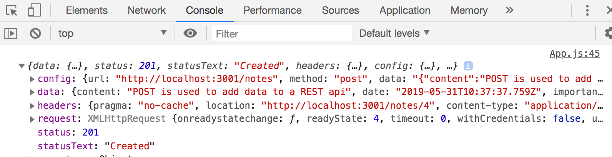
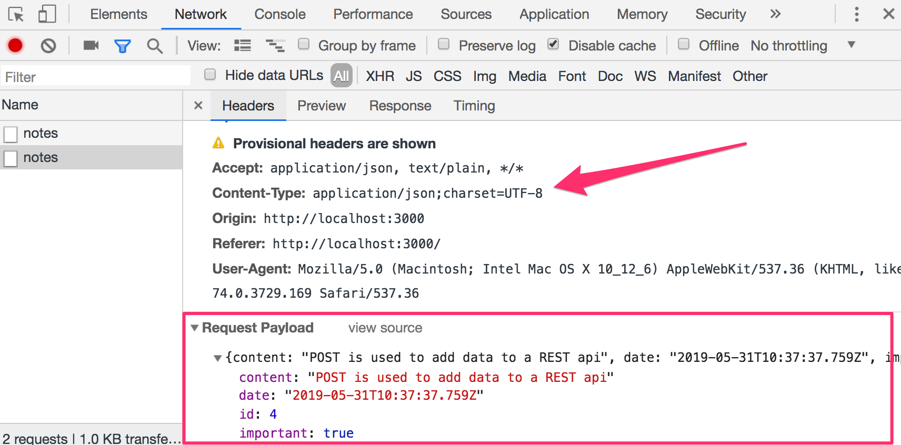
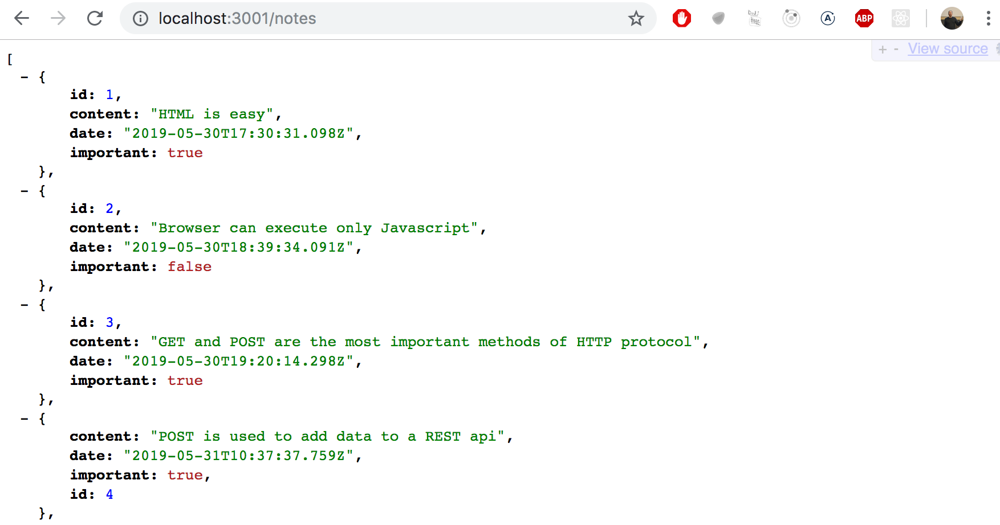
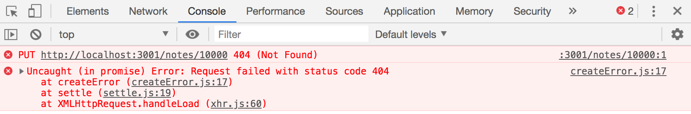
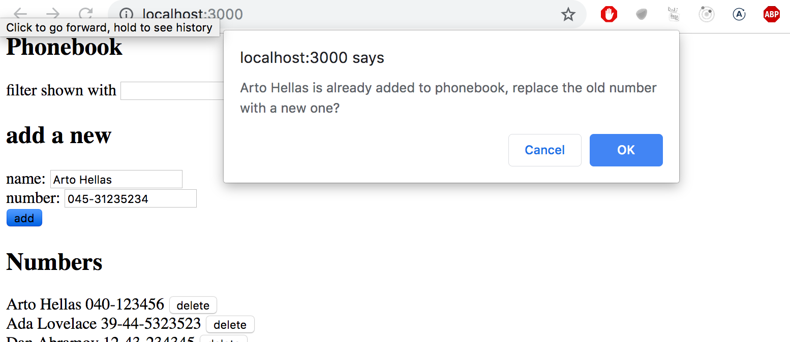

> Fullstack &#9656; [Parte 2](./part2.md) &#9656; Alterando datos en el servidor

&#9656; [a Renderizando una colección, módulos](./part2a.md)

&#9656; [b Formularios](./part2b.md)

&#9656; [c Obteniendo datos del servidor](./part2c.md)

<details><summary>d Alterando datos en el servidor</summary>

&#9656; [REST](#REST)

&#9656; [Envío de datos al servidor](#Envio-de-datos-al-servidor)

&#9656; [Cambiar la importancia de las notas](#Cambiar-la-importancia-de-las-notas)

&#9656; [Extraer la comunicacion con el backend en un modulo separado](#Extraer-la-comunicacion-con-el-backend-en-un-modulo-separado)

&#9656; [Sintaxis mas limpia para definir objetos literales](#Sintaxis-mas-limpia-para-definir-objetos-literales)

&#9656; [Promesas y errores](#Promesas-y-errores)

&#9656; [Ejercicios 2.15.-2.18.](#Ejercicios-2.15.-2.18.)

</details>

&#9656; [e Agregando estilos a la aplicación React](./part2emd)

# ⓓ Alterando datos en el servidor

Al crear notas en nuestra aplicación, deberíamos naturalmente desear almacenarlos en algún servidor backend. El paquete [json-server](https://github.com/typicode/json-server) afirma ser un llamado REST o API RESTful en su documentación:

> _Obtenga una API REST falsa completa ***sin codificación*** en ***menos de 30 segundos*** (en serio)_

El servidor json no coincide exactamente con la descripción proporcionada por la [definición](https://es.wikipedia.org/wiki/Transferencia_de_Estado_Representacional) del libro de texto de una API REST, pero tampoco la mayoría de las otras API que afirman ser RESTful.

Veremos más de cerca a REST en la [próxima parte](../../3/es/part3.md) del curso, pero es importante familiarizarnos en este punto con algunas de las [convenciones](https://en.wikipedia.org/wiki/Representational_state_transfer#Applied_to_web_services) utilizado por json-server y API REST en general. En particular, analizaremos el uso convencional de [rutas (routes)](https://github.com/typicode/json-server#routes), también conocido como URLs y tipos de solicitud HTTP, en REST.

## REST

En terminología REST, nos referimos a objetos de datos individuales, como las notas en nuestra aplicación, como _recursos_. Cada recurso tiene una dirección única asociada: su URL. De acuerdo con una convención general utilizada por json-server, podríamos ubicar una nota individual en la URL del recurso _notes/3_, donde 3 es la identificación del recurso. La URL de _notes_, por otro lado, apuntaría a una colección de recursos que contiene todas las notas.

Los recursos se obtienen del servidor con solicitudes HTTP GET. Por ejemplo, una solicitud HTTP GET a la URL _notes/3_ devolverá la nota que tiene el número de identificación 3. Una solicitud HTTP GET a la URL _notes_ devolverá una lista de todas las notas.

La creación de un nuevo recurso para almacenar una nota se realiza mediante una solicitud HTTP POST a la URL _notes_ de acuerdo con la convención REST a la que se adhiere el servidor json. Los datos del nuevo recurso de notas se envían en el _cuerpo_ de la solicitud.

json-server requiere que todos los datos se envíen en formato JSON. Lo que esto significa en la práctica es que los datos deben ser una cadena con el formato correcto y que la solicitud debe contener la cabecera de solicitud _Content-Type_ con el valor _application/json_.

## Envio de datos al servidor

Realicemos los siguientes cambios en el controlador de eventos responsable de crear una nueva nota:

```js
addNote = event => {
  event.preventDefault()
  const noteObject = {
    content: newNote,
    date: new Date(),
    important: Math.random() < 0.5,
  }

// highlight-start
  axios
    .post('http://localhost:3001/notes', noteObject)
    .then(response => {
      console.log(response)
    })
// highlight-end
}
```

Creamos un nuevo objeto para la nota pero omitimos la propiedad _id_, ¡ya que es mejor dejar que el servidor genere identificadores para nuestros recursos!

El objeto se envía al servidor mediante el método axios `post`. El controlador de eventos registrado registra la respuesta que se envía desde el servidor a la consola.

Cuando intentamos crear una nueva nota, la siguiente salida aparece en la consola:



El recurso de nota recién creado se almacena en el valor de la propiedad _data_ del objeto `response`.

A veces puede resultar útil inspeccionar las solicitudes HTTP en la pestaña _Network_ de las herramientas para desarrolladores de Chrome, que se utilizó mucho al comienzo de la [parte 0](../../0/es/part0b.md#http-get):



Podemos usar el inspector para verificar que los encabezados enviados en la solicitud POST sean los que esperábamos que fueran y que sus valores sean correctos.

Dado que los datos que enviamos en la solicitud POST eran un objeto JavaScript, axios supo automáticamente establecer el valor _application/json_ apropiado para la cabecera _Content-Type_.

La nueva nota aún no se muestra en la pantalla. Esto se debe a que no actualizamos el estado del componente _App_ cuando creamos la nueva nota. Arreglemos esto:

```js
addNote = event => {
  event.preventDefault()
  const noteObject = {
    content: newNote,
    date: new Date(),
    important: Math.random() > 0.5,
  }

  axios
    .post('http://localhost:3001/notes', noteObject)
    .then(response => {
      // highlight-start
      setNotes(notes.concat(response.data))
      setNewNote('')
      // highlight-end
    })
}
```

La nueva nota devuelta por el servidor backend se agrega a la lista de notas en el estado de nuestra aplicación en la forma habitual de usar la función `setNotes` y luego restablecer el formulario de creación de notas. Un [detalle importante](../../1/es/part1d.md##Manejo-de-matrices) para recordar es que el método `concat` no cambia el estado original del componente, sino que crea una nueva copia de la lista.

Una vez que los datos devueltos por el servidor comienzan a tener un efecto en el comportamiento de nuestras aplicaciones web, nos enfrentamos de inmediato a un nuevo conjunto de desafíos que surgen, por ejemplo, de la asincronicidad de la comunicación. Esto requiere nuevas estrategias de depuración, el registro de la consola y otros medios de depuración se vuelven cada vez más importantes, y también debemos desarrollar una comprensión suficiente de los principios tanto del tiempo de ejecución de JavaScript como de los componentes de React. Adivinar no será suficiente.

Es beneficioso inspeccionar el estado del servidor backend, por ejemplo, a través del navegador:



Esto hace posible verificar que todos los datos que pretendíamos enviar se recibieron realmente por el servidor.

En la siguiente parte del curso aprenderemos a implementar nuestra propia lógica en el backend. Luego examinaremos más de cerca herramientas como [postman](https://chrome.google.com/webstore/detail/postman/fhbjgbiflinjbdggehcddcbncdddomop) que nos ayudan a depurar nuestras aplicaciones de servidor. Sin embargo, inspeccionar el estado del servidor json a través del navegador es suficiente para nuestras necesidades actuales.

> **NB:** En la versión actual de nuestra aplicación, el navegador agrega la propiedad de fecha de creación a la nota. Dado que el reloj de la máquina que ejecuta el navegador puede estar configurado incorrectamente, es mucho más prudente dejar que el servidor backend genere esta marca de tiempo por nosotros. De hecho, esto es lo que haremos en la siguiente parte del curso.

El código para el estado actual de nuestra aplicación se puede encontrar en la rama _part2-5_ en [github](https://github.com/fullstack-hy2020/part2-notes/tree/part2-5).

## Cambiar la importancia de las notas

Agreguemos un botón a cada nota que se pueda usar para alternar su importancia.

Realizamos los siguientes cambios en el componente _Note_:

```js
const Note = ({ note, toggleImportance }) => {
  const label = note.important
    ? 'make not important' : 'make important'

  return (
    <li>
      {note.content}
      <button onClick={toggleImportance}>{label}</button>
    </li>
  )
}
```

Agregamos un botón al componente y asignamos su controlador de eventos como la función `toggleImportance` pasada en los props del componente.

El componente _App_ define una versión inicial de la función de controlador de eventos `toggleImportanceOf` y la pasa a cada componente _Note_:

```js
const App = () => {
  const [notes, setNotes] = useState([]) 
  const [newNote, setNewNote] = useState('')
  const [showAll, setShowAll] = useState(true)

  // ...

  // highlight-start
  const toggleImportanceOf = (id) => {
    console.log('importance of ' + id + ' needs to be toggled')
  }
  // highlight-end

  // ...

  return (
    <div>
      <h1>Notes</h1>
      <div>
        <button onClick={() => setShowAll(!showAll)}>
          show {showAll ? 'important' : 'all' }
        </button>
      </div>      
      <ul>
        {notesToShow.map((note, i) => 
          <Note
            key={i}
            note={note} 
            toggleImportance={() => toggleImportanceOf(note.id)} // highlight-line
          />
        )}
      </ul>
      // ...
    </div>
  )
}
```

Observe cómo cada nota recibe su propia _única_ función de controlador de eventos, ya que el _id_ de cada nota es único.

Por ejemplo, si _note.id_ es 3, la función de controlador de eventos devuelta por `toggleImportance(note.id)` será:

```js
() => { console.log('importance of 3 needs to be toggled') }
```

Un breve recordatorio aquí. La cadena impresa por el controlador de eventos se define de manera similar a Java agregando las cadenas:

```js
console.log('importance of ' + id + ' needs to be toggled')
```

La sintaxis de [plantilla de cadena](https://developer.mozilla.org/es/docs/Web/JavaScript/Reference/Template_literals) agregada en ES6 se puede usar para escribir cadenas similares de una manera mucho más agradable:

```js
console.log(`importance of ${id} needs to be toggled`)
```

Ahora podemos usar la sintaxis de "llave de dólares" para agregar partes a la cadena que evaluarán las expresiones de JavaScript, por ejemplo, el valor de una variable. Tenga en cuenta que las comillas utilizadas en las cadenas de plantillas difieren de las comillas utilizadas en las cadenas de JavaScript normales.

Las notas individuales almacenadas en el backend del servidor json se pueden modificar de dos formas diferentes haciendo solicitudes HTTP a la URL única de la nota. Podemos _reemplazar_ la nota completa con una solicitud HTTP PUT, o solo cambiar algunas de las propiedades de la nota con una solicitud HTTP PATCH.

La forma final de la función del controlador de eventos es la siguiente:

```js
const toggleImportanceOf = id => {
  const url = `http://localhost:3001/notes/${id}`
  const note = notes.find(n => n.id === id)
  const changedNote = { ...note, important: !note.important }

  axios.put(url, changedNote).then(response => {
    setNotes(notes.map(note => note.id !== id ? note : response.data))
  })
}
```

Casi todas las líneas de código en el cuerpo de la función contienen detalles importantes. La primera línea define la URL única para cada recurso de nota en función de su identificación.

El método de array [find](https://developer.mozilla.org/es/docs/Web/JavaScript/Reference/Global_Objects/Array/find) se usa para encontrar la nota que queremos modificar, y luego asignamos a la variable `note`.

Después de esto creamos un _nuevo objeto_ que es una copia exacta de la nota anterior, además de la propiedad important.

El código para crear el nuevo objeto que usa la sintaxis de [object spread](https://developer.mozilla.org/es/docs/Web/JavaScript/Reference/Operators/Spread_syntax) puede parecer un poco extraño:

```js
const changedNote = { ...note, important: !note.important }
```

En la práctica, `{ ...note }` crea un nuevo objeto con copias de todas las propiedades del objeto `note` . Cuando agregamos propiedades dentro de las llaves después del objeto extendido, por ejemplo, `{... note, important: true}`, entonces el valor de la propiedad `important` del nuevo objeto será `true`. En nuestro ejemplo, la propiedad `important` obtiene la negación de su valor anterior en el objeto original.

Hay algunas cosas que señalar. ¿Por qué hicimos una copia del objeto de nota que queríamos modificar, cuando el siguiente código también parece funcionar: 

```js
const note = notes.find(n => n.id === id)
note.important = !note.important

axios.put(url, note).then(response => {
  // ...
```

No se recomienda porque la variable `note` es una referencia a un elemento en el array `notes` en el estado del componente, y como recordamos, nunca debemos mutar el estado directamente en React.

También vale la pena señalar que el nuevo objeto `changedNote` es solo una llamada [copia superficial](https://en.wikipedia.org/wiki/Object_copying#Shallow_copy), lo que significa que los valores del nuevo objeto son los mismos que los valores del objeto antiguo. Si los valores del objeto antiguo fueran objetos en sí mismos, los valores copiados en el nuevo objeto harían referencia a los mismos objetos que estaban en el objeto antiguo.

Luego, la nueva nota se envía con una solicitud PUT al backend donde reemplazará el objeto anterior.

La función de devolución de llamada establece el estado del componente `notes` en una nueva matriz que contiene todos los elementos de la matriz de `notes` anterior, excepto la nota anterior que se reemplaza por la versión actualizada devuelta por el servidor:

```js
axios.put(url, changedNote).then(response => {
  setNotes(notes.map(note => note.id !== id ? note : response.data))
})
```

Esto se logra con el método `map`:

```js
notes.map(note => note.id !== id ? note : response.data)
```

El método map crea una nueva matriz al mapear cada elemento de la matriz anterior a un elemento de la nueva matriz. En nuestro ejemplo, la nueva matriz se crea de forma condicional de modo que si `note.id !== id` es verdadero, simplemente copiamos el elemento de la matriz anterior en la nueva matriz. Si la condición es falsa, el objeto de nota devuelto por el servidor se agrega a la matriz.

Este truco de `map` puede parecer un poco extraño al principio, pero vale la pena dedicar un tiempo a comprenderlo. Usaremos este método muchas veces a lo largo del curso.

## Extraer la comunicacion con el backend en un modulo separado

El componente _App_ se ha hinchado un poco después de agregar el código para comunicarse con el servidor backend. En el espíritu del [principio de responsabilidad única](https://es.wikipedia.org/wiki/Principio_de_responsabilidad_%C3%BAnica), consideramos prudente extraer esta comunicación en su propio [módulo](../../2/es/part2a.md#Refactorizando-módulos).

Creemos un directorio _src/services_ y agreguemos un archivo allí llamado _notes.js_:

```js
import axios from 'axios'
const baseUrl = 'http://localhost:3001/notes'

const getAll = () => {
  return axios.get(baseUrl)
}

const create = newObject => {
  return axios.post(baseUrl, newObject)
}

const update = (id, newObject) => {
  return axios.put(`${baseUrl}/${id}`, newObject)
}

export default {
  getAll: getAll,
  create: create,
  update: update
}
```

El módulo devuelve un objeto que tiene tres funciones (_getAll_, _create_ y _update_) como propiedades que se ocupan de las notas. Las funciones devuelven directamente las promesas devueltas por los métodos de axios.

El componente _App_ usa `import` para obtener acceso al módulo:

```js
import noteService from './services/notes' // highlight-line

const App = () => {
```

Las funciones del módulo se pueden usar directamente con la variable importada `noteService` de la siguiente manera:

```js
const App = () => {
  // ...

  useEffect(() => {
    // highlight-start
    noteService
      .getAll()
      .then(response => {
        setNotes(response.data)
      })
    // highlight-end
  }, [])

  const toggleImportanceOf = id => {
    const note = notes.find(n => n.id === id)
    const changedNote = { ...note, important: !note.important }

    // highlight-start
    noteService
      .update(id, changedNote)
      .then(response => {
        setNotes(notes.map(note => note.id !== id ? note : response.data))
      })
    // highlight-end
  }

  const addNote = (event) => {
    event.preventDefault()
    const noteObject = {
      content: newNote,
      date: new Date().toISOString(),
      important: Math.random() > 0.5
    }

// highlight-start
    noteService
      .create(noteObject)
      .then(response => {
        setNotes(notes.concat(response.data))
        setNewNote('')
      })
// highlight-end
  }

  // ...
}

export default App
```

Podríamos llevar nuestra implementación un paso más allá. Cuando el componente _App_ usa las funciones, recibe un objeto que contiene la respuesta completa para la solicitud HTTP:

```js
noteService
  .getAll()
  .then(response => {
    setNotes(response.data)
  })
```

El componente _App_ solo usa la propiedad _response.data_ del objeto de respuesta.

El módulo sería mucho más agradable de usar si, en lugar de la respuesta HTTP completa, solo obtuviéramos los datos de respuesta. El uso del módulo se vería así:

```js
noteService
  .getAll()
  .then(initialNotes => {
    setNotes(initialNotes)
  })
```

Podemos lograr esto cambiando el código en el módulo de la siguiente manera (el código actual contiene algo de copiar y pegar, pero lo toleraremos por ahora):

```js
import axios from 'axios'
const baseUrl = 'http://localhost:3001/notes'

const getAll = () => {
  const request = axios.get(baseUrl)
  return request.then(response => response.data)
}

const create = newObject => {
  const request = axios.post(baseUrl, newObject)
  return request.then(response => response.data)
}

const update = (id, newObject) => {
  const request = axios.put(`${baseUrl}/${id}`, newObject)
  return request.then(response => response.data)
}

export default {
  getAll: getAll,
  create: create,
  update: update
}
```

Ya no devolvemos la promesa devuelta por axios directamente. En su lugar, asignamos la promesa a la variable `request` y llamamos a su método `then`:

```js
const getAll = () => {
  const request = axios.get(baseUrl)
  return request.then(response => response.data)
}
```

La última fila en nuestra función es simplemente una expresión más compacta del mismo código que se muestra a continuación:

```js
const getAll = () => {
  const request = axios.get(baseUrl)
  // highlight-start
  return request.then(response => {
    return response.data
  })
  // highlight-end
}
```

La función `getAll` modificada todavía devuelve una promesa, como el método `then` de una promesa también [devuelve una promesa](https://developer.mozilla.org/es/docs/Web/JavaScript/Reference/Global_Objects/Promise/then).

Después de definir el parámetro del método `then` para devolver directamente _response.data_, hemos conseguido que la función `getAll` funcione como queríamos. Cuando la solicitud HTTP es exitosa, la promesa devuelve los datos enviados en la respuesta del backend.

Tenemos que actualizar el componente _App_ para que funcione con los cambios realizados en nuestro módulo. Tenemos que arreglar las funciones de devolución de llamada dadas como parámetros a los métodos del objeto `noteService`, de modo que utilicen los datos de respuesta devueltos directamente:

```js
const App = () => {
  // ...

  useEffect(() => {
    noteService
      .getAll()
      // highlight-start
      .then(initialNotes => {
        setNotes(initialNotes)
      // highlight-end
      })
  }, [])

  const toggleImportanceOf = id => {
    const note = notes.find(n => n.id === id)
    const changedNote = { ...note, important: !note.important }

    noteService
      .update(id, changedNote)
      // highlight-start
      .then(returnedNote => {
        setNotes(notes.map(note => note.id !== id ? note : returnedNote))
      // highlight-end
      })
  }

  const addNote = (event) => {
    event.preventDefault()
    const noteObject = {
      content: newNote,
      date: new Date().toISOString(),
      important: Math.random() > 0.5
    }

    noteService
      .create(noteObject)
      // highlight-start
      .then(returnedNote => {
        setNotes(notes.concat(returnedNote))
      // highlight-end
        setNewNote('')
      })
  }

  // ...
}
```

Todo esto es bastante complicado e intentar explicarlo puede dificultar la comprensión. Internet está lleno de material que discute el tema, como [este](https://javascript.info/promise-chaining).

El libro "Async and performance" de la serie de libros [You don't know JS](https://github.com/getify/You-Dont-Know-JS/tree/1st-ed) explica el tema [bien](https://github.com/getify/You-Dont-Know-JS/blob/1st-ed/async%20%26%20performance/ch3.md), pero la explicación tiene muchas páginas.

Las promesas son fundamentales para el desarrollo moderno de JavaScript y se recomienda encarecidamente invertir una cantidad de tiempo razonable en comprenderlas.

## Sintaxis mas limpia para definir objetos literales

El módulo que define servicios relacionados con notas actualmente exporta un objeto con las propiedades _getAll_, _create_ y _update_ que son asignados a funciones para el manejo de notas.

La definición del módulo fue:

```js
import axios from 'axios'
const baseUrl = 'http://localhost:3001/notes'

const getAll = () => {
  const request = axios.get(baseUrl)
  return request.then(response => response.data)
}

const create = newObject => {
  const request = axios.post(baseUrl, newObject)
  return request.then(response => response.data)
}

const update = (id, newObject) => {
  const request = axios.put(`${baseUrl}/${id}`, newObject)
  return request.then(response => response.data)
}

export default {
  getAll: getAll,
  create: create,
  update: update
}
```

El módulo exporta el siguiente objeto, de aspecto bastante peculiar:

```js
{
  getAll: getAll,
  create: create,
  update: update
}
```

Las etiquetas a la izquierda de los dos puntos en la definición del objeto son las _claves_ del objeto, mientras que las que están a la derecha de este son _variables_ que se definen dentro del módulo.

Dado que los nombres de las claves y las variables asignadas son los mismos, podemos escribir la definición del objeto con una sintaxis más compacta:

```js
{
  getAll,
  create,
  update
}
```

Como resultado, la definición del módulo se simplifica de la siguiente forma:

```js
import axios from 'axios'
const baseUrl = 'http://localhost:3001/notes'

const getAll = () => {
  const request = axios.get(baseUrl)
  return request.then(response => response.data)
}

const create = newObject => {
  const request = axios.post(baseUrl, newObject)
  return request.then(response => response.data)
}

const update = (id, newObject) => {
  const request = axios.put(`${baseUrl}/${id}`, newObject)
  return request.then(response => response.data)
}

export default { getAll, create, update } // highlight-line
```

Al definir el objeto con esta notación más corta, utilizamos una [nueva característica](https://developer.mozilla.org/en-US/docs/Web/JavaScript/Reference/Operators/Object_initializer#Property_definitions) que se introdujo a JavaScript a través de ES6, lo que permite una forma un poco más compacta de definir objetos mediante variables.

Para demostrar esta característica, consideremos una situación en la que tenemos los siguientes valores asignados a las variables:

```js 
const name = 'Leevi'
const age = 0
```

En versiones anteriores de JavaScript, teníamos que definir un objeto como este: 

```js 
const person = {
  name: name,
  age: age
}
```

Sin embargo, dado que tanto los campos de propiedad como los nombres de las variables en el objeto son iguales, basta con escribir lo siguiente en ES6 JavaScript:

```js 
const person = { name, age }
```

El resultado es idéntico para ambas expresiones. Ambos crean un objeto con una propiedad _name_ con el valor _Leevi_ y una propiedad _age_ con el valor _0_.

## Promesas y errores

Si nuestra aplicación permitiera a los usuarios eliminar notas, podríamos terminar en una situación en la que un usuario intenta cambiar la importancia de una nota que ya ha sido eliminada del sistema.

Simulemos esta situación haciendo que la función `getAll` del servicio de notas devuelva una nota "codificada" que en realidad no existe en el servidor backend:

```js
const getAll = () => {
  const request = axios.get(baseUrl)
  const nonExisting = {
    id: 10000,
    content: 'This note is not saved to server',
    date: '2019-05-30T17:30:31.098Z',
    important: true,
  }
  return request.then(response => response.data.concat(nonExisting))
}
```

Cuando intentamos cambiar la importancia de la nota codificada, vemos el siguiente mensaje de error en la consola. El error dice que el servidor backend respondió a nuestra solicitud HTTP PUT con un código de estado 404 _not found (no encontrado)_.



La aplicación debería poder manejar este tipo de situaciones de error con elegancia. Los usuarios no podrán saber que se ha producido un error a menos que tengan la consola abierta. La única forma en que se puede ver el error en la aplicación es que hacer clic en el botón no afecta la importancia de la nota.

[Anteriormente](../../2/es/part2c.md#Axios-y-promesas) mencionamos que una promesa puede estar en uno de tres estados diferentes. Cuando falla una solicitud HTTP, la promesa asociada se _rechaza_. Nuestro código actual no maneja este rechazo de ninguna manera.

El rechazo de una promesa se [maneja](https://developer.mozilla.org/es/docs/Web/JavaScript/Guide/Using_promises) proporcionando el método `then` con una segunda función de devolución de llamada, que se llama en la situación en la que se rechaza la promesa.

La forma más común de agregar un controlador para las promesas rechazadas es usar el método [catch](https://developer.mozilla.org/es/docs/Web/JavaScript/Reference/Global_Objects/Promise/catch).

En la práctica, el controlador de errores para las promesas rechazadas se define así:

```js

axios
  .get('http://example.com/probably_will_fail')
  .then(response => {
    console.log('success!')
  })
  .catch(error => {
    console.log('fail')
  })
```

Si la solicitud falla, se llama al controlador de eventos registrado con el método `catch`.

El método `catch` se utiliza a menudo colocándolo más profundamente en la cadena de promesas.

Cuando nuestra aplicación realiza una solicitud HTTP, de hecho estamos creando una [cadena de promesas](https://javascript.info/promise-chaining):

```js
axios
  .put(`${baseUrl}/${id}`, newObject)
  .then(response => response.data)
  .then(changedNote => {
    // ...
  })
```

El método `catch` se puede utilizar para definir una función de controlador en el final de una cadena de promesa, que se llama una vez que cualquier promesa en la cadena arroja un error y la promesa es _rechazada_.

```js
axios
  .put(`${baseUrl}/${id}`, newObject)
  .then(response => response.data)
  .then(changedNote => {
    // ...
  })
  .catch(error => {
    console.log('fail')
  })
```

Usemos esta función y registremos un controlador de errores en el componente _App_:

```js
const toggleImportanceOf = id => {
  const note = notes.find(n => n.id === id)
  const changedNote = { ...note, important: !note.important }

  noteService
    .update(id, changedNote).then(returnedNote => {
      setNotes(notes.map(note => note.id !== id ? note : returnedNote))
    })
    // highlight-start
    .catch(error => {
      alert(
        `the note '${note.content}' was already deleted from server`
      )
      setNotes(notes.filter(n => n.id !== id))
    })
    // highlight-end
}
```

El mensaje de error es mostrado al usuario con la vieja y confiable [alerta](https://developer.mozilla.org/es/docs/Web/API/Window/alert), un cuadro de diálogo emergente, y la nota eliminada se filtra del estado.

La eliminación de una nota ya eliminada del estado de la aplicación se realiza con el método array [filter](https://developer.mozilla.org/es/docs/Web/JavaScript/Reference/Global_Objects/Array/filter), que devuelve una nueva matriz que comprende solo los elementos de la lista para los cuales la función que se pasó como parámetro devuelve verdadero para:

```js
notes.filter(n => n.id !== id)
```

Probablemente no sea una buena idea usar alert en aplicaciones React más serias. Pronto aprenderemos una forma más avanzada de mostrar mensajes y notificaciones a los usuarios. Sin embargo, hay situaciones en las que un método simple y probado en batalla como `alert` puede funcionar como punto de partida. Siempre se podría agregar un método más avanzado más adelante, dado que hay tiempo y energía para ello.

El código para el estado actual de nuestra aplicación se puede encontrar en la rama _part2-6_ en [github](https://github.com/fullstack-hy2020/part2-notes/tree/part2-6).

## Ejercicios 2.15.-2.18.

### 2.15: Guía telefónica, paso 7

Regresemos a nuestra aplicación de agenda telefónica.

Actualmente, los números que se agregan a la agenda no se guardan en un servidor backend. Arregla esta situación.

### 2.16: Guía telefónica, paso 8

Extraiga el código que maneja la comunicación con el backend en su propio módulo siguiendo el ejemplo que se mostró anteriormente en esta parte del material del curso.

### 2.17: Guía telefónica, paso 9

Permita que los usuarios eliminen entradas de la agenda. La eliminación se puede realizar a través de un botón dedicado para cada persona en la lista de la agenda. Puede confirmar la acción del usuario utilizando el método [window.confirm](https://developer.mozilla.org/es/docs/Web/API/Window/confirm):


El recurso asociado para una persona en el backend se puede eliminar haciendo una solicitud HTTP DELETE a la URL del recurso. Si estamos eliminando, por ejemplo, una persona que tiene el _id_ 2, tendríamos que hacer una solicitud HTTP DELETE a la URL _localhost:3001/persons/2_. No se envían datos con la solicitud.

Puede realizar una solicitud HTTP DELETE con la librería [axios](https://github.com/axios/axios) de la misma manera que hacemos todas las demás solicitudes.

**NB:** No puede usar el nombre `delete` para una variable porque es una palabra reservada en JavaScript. Por ejemplo, lo siguiente no es posible:

```js
// use otro nombre para la variable!
const delete = (id) => {
  // ...
}
```

### 2.18*: Guía telefónica, paso 10

Cambie la funcionalidad de modo que si se agrega un número a un usuario ya existente, el nuevo número reemplazará al anterior. Se recomienda utilizar el método HTTP PUT para actualizar el número de teléfono.

Si la información de la persona ya está en la agenda, la aplicación puede confirmar la acción del usuario:



---

<div align="center">

[Proponer cambios en el material](https://github.com/sebastiantorres86/Fullstack-Spanish/edit/main/src/content/2/es/part2d.md)

</div>

<div align="right">
  <a href="../../2/es/part2e.md">Parte 2e<br>Siguiente parte</a>
</div>