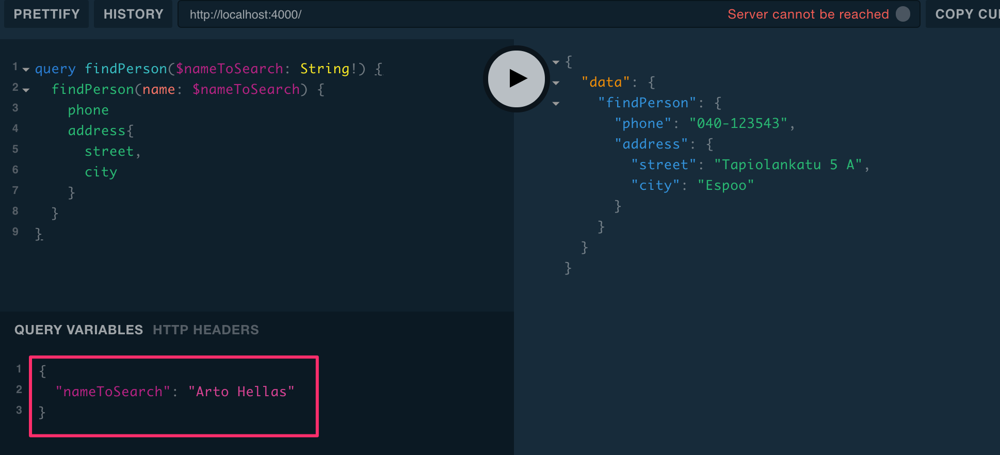
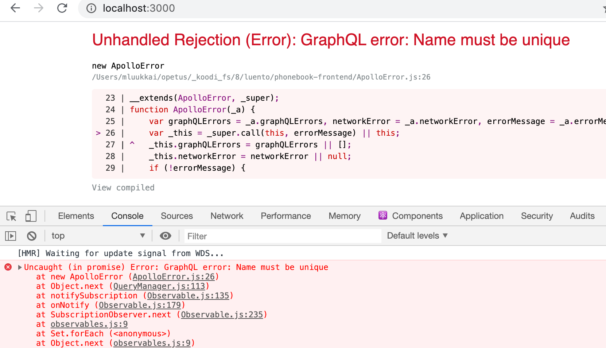
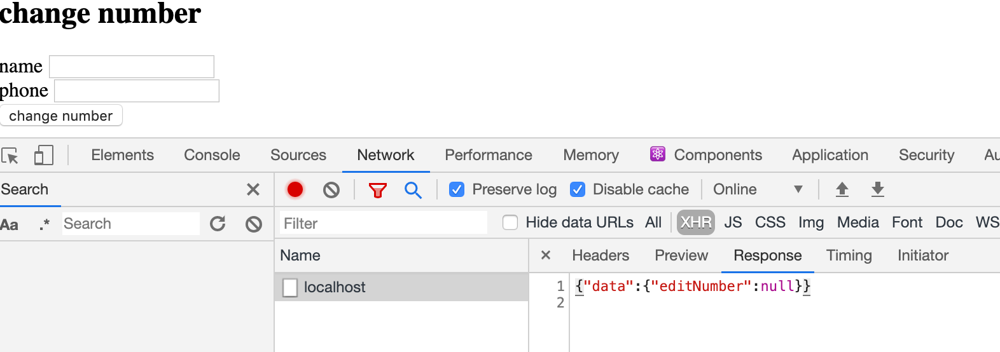
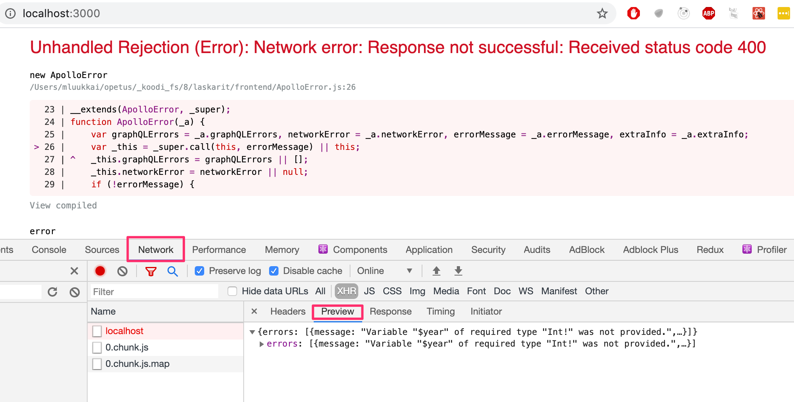
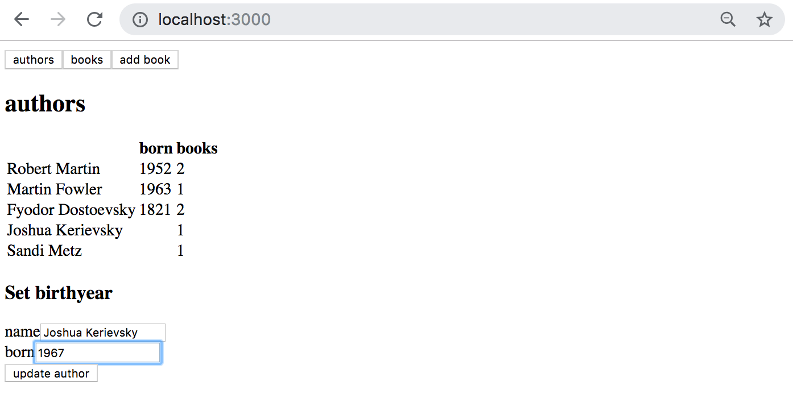

<div class="content">

We will next implement a React-app which uses the GraphQL server we created.

The current code of the server can be found on [Github](https://github.com/fullstack-hy2020/graphql-phonebook-backend/tree/part8-3), branch <i>part8-3</i>.

In theory, we could use GraphQL with HTTP POST -requests. The following shows an example of this with Postman. 


The communication works by sending HTTP POST -requests to http://localhost:4000/graphql. The query itself is a string sent as the value of the key <i>query</i>.

We could take care of the communication between the React-app and GraphQl by using Axios. However most of the time it is not very sensible to do so. It is a better idea to use a higher order library capable of abstracting the unnecessary details of the communication. 

At the moment there are two good options: [Relay](https://facebook.github.io/relay/) by Facebook and [Apollo Client](https://www.apollographql.com/docs/react/). From these two Apollo is absolutely more popular, and we will also be using it. 

### Apollo client

<!-- Käytetään kurssilla Apollo Clientin versiota [3.0-beta](https://www.apollographql.com/docs/react/v3.0-beta/), tällä hetkellä (20.2.2020) uusin virallisesti julkaisatu versio on 2.6. eli kun luet dokumentaatiota, muista vaihtaa näytettävän dokumentaation versio vastaamaan 3.0 betaa: -->
In this course we will use the version [3.0-beta](https://www.apollographql.com/docs/react/v3.0-beta/) of Apollo Client. 
At the moment (20.2.2020) 2.6 is the latest officially released version, so when you are reading the documentation remember to select the documentation of 3.0 beta:


Create a new React-app and install the dependencies required by [Apollo client](https://www.apollographql.com/docs/react/v3.0-beta/get-started/#installation).

<!-- Luodaan uusi React-sovellus ja asennetaan siihen [Apollo clientin](https://www.apollographql.com/docs/react/get-started/#installation) vaatimat riippuvuudet. -->
We'll create a new React application and install the dependencies required by [Apollo client](https://www.apollographql.com/docs/react/get-started/#installation).

```bash
npm install @apollo/client graphql
```

We'll start with the following code for our application. 

```js
import React from 'react'
import ReactDOM from 'react-dom'
import App from './App'

import { ApolloClient, HttpLink, InMemoryCache, gql } from '@apollo/client'

const client = new ApolloClient({
  cache: new InMemoryCache(),
  link: new HttpLink({
    uri: 'http://localhost:4000',
  })
})

const query = gql`
query {
  allPersons  {
    name,
    phone,
    address {
      street,
      city
    }
    id
  }
}
`

client.query({ query })
  .then((response) => {
    console.log(response.data)
  })

ReactDOM.render(<App />, document.getElementById('root'))
```

The beginning of the code creates a new [client](https://www.apollographql.com/docs/react/v3.0-beta/get-started/#create-a-client) - object, which is then used to send a query to the server: 


```js
client.query({ query })
  .then((response) => {
    console.log(response.data)
  })
```

The servers response is printed to the console: 


The application can communicate with a GraphQL server using the _client_ object. The client can be made accessible for all components of the application by wrapping the <i>App</i> component with [ApolloProvider](https://www.apollographql.com/docs/react/v3.0-beta/get-started/#connect-your-client-to-react).

```js
import React from 'react'
import ReactDOM from 'react-dom'
import App from './App'

import { 
  ApolloClient, ApolloProvider, HttpLink, InMemoryCache // highlight-line
} from '@apollo/client' 

const client = new ApolloClient({
  cache: new InMemoryCache(),
  link: new HttpLink({
    uri: 'http://localhost:4000',
  })
})

ReactDOM.render(
  <ApolloProvider client={client}> // highlight-line
    <App />
  </ApolloProvider>, // highlight-line
  document.getElementById('root')
)
```

### Making queries

We are ready to implement the main view of the application, which shows a list of phone numbers. 


<!-- Apollo Client tarjoaa muutaman vaihtoehtoisen tavan [kyselyjen](https://www.apollographql.com/docs/react/v3.0-beta/data/queries/) tekemiselle. Tämän hetken vallitseva käytäntö on hook-funktion [useQuery](https://www.apollographql.com/docs/react/v3.0-beta/api/react/hooks/#usequery) käyttäminen. -->
Apollo Client offers a few alternatives for making [queries](https://www.apollographql.com/docs/react/v3.0-beta/data/queries/). 
Currently the use of the hook-function [useQuery](https://www.apollographql.com/docs/react/v3.0-beta/api/react/hooks/#usequery) is the dominant practice.

<!-- Kyselyn tekevän komponentin <i>App</i> koodi näyttää seuraavalta: -->
The query is made by the <i>App</i> component, which's code is as follows:

```js
import React from 'react'
import { gql, useQuery } from '@apollo/client';

const ALL_PERSONS = gql`
query {
  allPersons  {
    name
    phone
    id
  }
}
`

const App = () => {
  const result = useQuery(ALL_PERSONS)

  if (result.loading)  {
    return <div>loading...</div>
  }

  return (
    <div>
      {result.data.allPersons.map(p => p.name).join(', ')}
    </div>
  )
}

export default App
```

<!-- Hook-funktion _useQuery_ kutsuminen suorittaa parametrina annetun kyselyn. Hookin kutsuminen palauttaa olion, joka -->
<!-- jolla on [useita kenttiä](https://www.apollographql.com/docs/react/v3.0-beta/api/react/hooks/#result). Kenttä <i>loading</i> on arvoltaan tosi, jos kyselyyn ei ole saatu vielä vastausta. Tässä tilanteessa renderöitävä koodi on  -->
When called, _useQuery_ makes the query it receives as a parameter.
It returns an object with multiple [fields](https://www.apollographql.com/docs/react/v3.0-beta/api/react/hooks/#result).
The field <i>loading</i> is true if the query has not received a response yet. 
Then the following code gets rendered:

```js
if ( result.loading ) {
  return <div>loading...</div>
}
```

<!-- Kun tulos on valmis, otetaan tuloksen kentästä <i>data</i> kyselyn <i>allPersons</i> vastaus ja renderöidään luettelossa olevat nimet ruudulle. -->
When response is received, the result of the <i>allPersons</i> query can be found from the <i>data</i> field, and we can render the list of names to the screen.

```js
<div>
  {result.data.allPersons.map(p => p.name).join(', ')}
</div>
```

<!-- Eriytetään henkilöiden näyttäminen omaan komponenttiin -->
Let's separate displaying the list of persons into its own component

```js
const Persons = ({ persons }) => {
  return (
    <div>
      <h2>Persons</h2>
      {persons.map(p =>
        <div key={p.name}>
          {p.name} {p.phone}
        </div>  
      )}
    </div>
  )
}
```

<!-- Komponentti _App_ siis hoitaa edelleen kyselyn ja välittää tuloksen uuden komponentin renderöitäväksi: -->
The _App_ component still makes the query, and passes the result to the new component to be rendered:

```js
const App = () => {
  const result = useQuery(ALL_PERSONS)

  if (result.loading)  {
    return <div>loading...</div>
  }

  return (
    <Persons persons = {result.data.allPersons}/>
  )
}
```

### Named queries and variables

Let's implement functionality for viewing the address details of a person. The <i>findPerson</i> query is well suited for this. 

The queries we did in the last chapter had the parameter hardcoded into the query:

```js
query {
  findPerson(name: "Arto Hellas") {
    phone 
    city 
    street
    id
  }
}
```

When we do queries programmatically, we must be able to give them parameters dynamically. 

GraphQL [variables](https://graphql.org/learn/queries/#variables) are well suited for this. To be able to use variables, we must also name our queries. 

<!-- Sopiva muoto kyselylle on seuraava: -->
A good format for the query is this:

```js
query findPersonByName($nameToSearch: String!) {
  findPerson(name: $nameToSearch) {
    name
    phone 
    address {
      street
      city
    }
  }
}
```

The name of the query is <i>findPersonByName</i>, and it is given a string <i>$nameToSearch</i> as a parameter. 

It is also possible to do queries with parameters with the GraphQL Playground. The parameters are given in <i>Query variables</i>:



<!-- Asken käyttämämme _useQuery_ toimii hyvin tilanteissa, joissa kysely on tarkoitus suorittaa heti komponentin renderöinnin yhteydessä. Nyt kuitenkin haluamme tehdä kyselyn vasta siinä vaiheessa kun käyttäjä haluaa nähdä jonkin henkilön tiedot, eli kysely tehdään vasta [sitä tarvittaessa](https://www.apollographql.com/docs/react/v3.0-beta/data/queries/#executing-queries-manually).  -->
The _useQuery_ hook is well suited for situations where the query is done when the component is rendered. 
However now we want to make the query only when a user wants to see the details of a specific person, so the query is done only [as required](https://www.apollographql.com/docs/react/v3.0-beta/data/queries/#executing-queries-manually).


<!-- Tähän tilanteeseen sopii hook-funktio [useLazyQuery](https://www.apollographql.com/docs/react/v3.0-beta/api/react/hooks/#uselazyquery). Komponentti <i>Persons</i> muuttuu seuraavasti: -->
For this this situation the hook-function [useLazyQuery](https://www.apollographql.com/docs/react/v3.0-beta/api/react/hooks/#uselazyquery) is a good choice. 
The <i>Persons</i> component becomes:

```js
// highlight-start
const FIND_PERSON = gql`
  query findPersonByName($nameToSearch: String!) {
    findPerson(name: $nameToSearch) {
      name
      phone 
      id
      address {
        street
        city
      }
    }
  }
`
// highlight-end

const Persons = ({ persons }) => {
  // highlight-start
  const [getPerson, result] = useLazyQuery(FIND_PERSON) 
  const [person, setPerson] = useState(null)
// highlight-end

// highlight-start
  const showPerson = (name) => {
    getPerson({ variables: { nameToSearch: name } })
  }
  // highlight-end

// highlight-start
  useEffect(() => {
    if (result.data) {
      setPerson(result.data.findPerson)
    }
  }, [result])
  // highlight-end

// highlight-start
  if (person) {
    return(
      <div>
        <h2>{person.name}</h2>
        <div>{person.address.street} {person.address.city}</div>
        <div>{person.phone}</div>
        <button onClick={() => setPerson(null)}>close</button>
      </div>
    )
  }
  // highlight-end
  
  return (
    <div>
      <h2>Persons</h2>
      {persons.map(p =>
        <div key={p.name}>
          {p.name} {p.phone}
          // highlight-start
          <button onClick={() => showPerson(p.name)} >
            show address
          </button> 
          // highlight-end
        </div>  
      )}
    </div>
  )
}

export default Persons
```

<!-- Koodi on kasvanut paljon, ja kaikki lisäykset eivät ole täysin ilmeisiä. -->
The code has changed quite a lot, and all of the changes are not completely apparent. 


<!-- Jos henkilön yhteydessä olevaa nappia painetaan, suoritetaan klikkauksenkäsittelijä _showPerson_, joka tekee GraphQL-kyselyn henkilön tiedoista: -->
When a person's "show address" button is clicked, its event handler 
_showPerson_ is executed, and makes a GraphQL query to fetch the persons details: 

```js
const [getPerson, result] = useLazyQuery(FIND_PERSON) 

// ...

const showPerson = (name) => {
  getPerson({ variables: { nameToSearch: name } })
}
```

<!-- Kyselyn muuttujalle _nameToSearch_ määritellään arvo kutsuttaessa. -->
The query's _nameToSearch_ variable receives a value when the query is run. 

<!-- Kyselyn vastaus tulee muuttujaan _result_, ja sen arvo sijoitetaan komponentin tilan muutujaan _person_. Sijoitus tehdään _useEffect_-hookissa: -->
The query response is saved to the variable _result_, and its value is saved to the component's state _person_ in the _useEffect_ hook. 

```js
useEffect(() => {
  if (result.data) {
    setPerson(result.data.findPerson)
  }
}, [result])
```

<!-- Hookin toisena parametrina on _result.data_, tämä saa aikaan sen, että hookin ensimmäisenä parametrina oleva funktio suoritetaan <i>aina kun kyselyssä haetaan uuden henkilön tiedot</i>. Jos päivitystä ei hoidettaisi kontrolloidusti hookissa, seuraisi ongelmia sen jälkeen kun yksittäisen henkilön näkymästä palataan kaikkien henkilöiden näkymään. -->
The hook's second parameter is _result_, so function given to the hook as its second parameter is executed <i>every time the query fetches the details of a different person</i>. 
Would we not handle the update in a controlled way in a hook, returning from a single person view to a list of all persons would cause problems. 


If the state _person_ has a value, instead of showing a list of all persons, only the details of one person are shown. 


<!-- Yksittäisen henkilön näkymästä palataan kaikkien henkilöiden näkymään sijoittamalla tilan muuttujan _person_ arvoksi _null_. -->
When a user wants to return to the persons list, the _person_ state is set to _null_.

The solution is not the neatest possible, but it is good enough for us. 

The current code of the application can be found on [Github](https://github.com/fullstack-hy2020/graphql-phonebook-frontend/tree/part8-1) branch <i>part8-1</i>.

### Cache

When we do multiple queries for example the address details of Arto Hellas, we notice something interesting: The query to the backend is done only the first time around. After this, despite of the same query being done again by the code, the query is not sent to the backend. 


Apollo client saves the responses of queries to [cache](https://www.apollographql.com/docs/react/v3.0-beta/caching/cache-configuration/). To optimize performance if the response to a query is already in the cache, the query is not sent to the server at all. 

It is possible to install [Apollo Client devtools](https://chrome.google.com/webstore/detail/apollo-client-developer-t/jdkknkkbebbapilgoeccciglkfbmbnfm/related) to Chrome to view the state of the cache. 


Data in the cache is organized by query. Because <i>Person</i> objects have an identifying field <i>id</i> which is type <i>ID</i>, if the same object is returned by multiple queries, Apollo is able to combine them into one. 
Because of this, doing <i>findPerson</i> queries for the address details of Arto Hellas has updated the address details also for the query <i>allPersons</i>.

### Doing mutations

Let's implement functionality for adding new persons. 

 In the previous chapter we hardcoded the parameters for mutations. Now we need a version of the addPerson mutation which uses [variables](https://graphql.org/learn/queries/#variables):

```js
const CREATE_PERSON = gql`
mutation createPerson($name: String!, $street: String!, $city: String!, $phone: String) {
  addPerson(
    name: $name,
    street: $street,
    city: $city,
    phone: $phone
  ) {
    name
    phone
    id
    address {
      street
      city
    }
  }
}
`
```

<!-- Mutaatioiden tekemiseen sopivan toiminnallisuuden tarjoaa hook-funktio [useMutation](https://www.apollographql.com/docs/react/v3.0-beta/api/react/hooks/#usemutation).  -->
The hook-function [useMutation](https://www.apollographql.com/docs/react/v3.0-beta/api/react/hooks/#usemutation) provides the functionality for making mutations. 

<!-- Tehdään sovellukseen uusi komponentti uuden henkilön lisämiseen: -->
Let's create a new component for adding a new person to the directory:

```js
import React, { useState } from 'react'
import { gql, useMutation } from '@apollo/client'

const CREATE_PERSON = gql`
  // ...
`

const PersonForm = () => {
  const [name, setName] = useState('')
  const [phone, setPhone] = useState('')
  const [street, setStreet] = useState('')
  const [city, setCity] = useState('')

  const [ createPerson ] = useMutation(CREATE_PERSON) // highlight-line

  const submit = (event) => {
    event.preventDefault()

    // highlight-start
    createPerson({  variables: { name, phone, street, city } })
    // highlight-end

    setName('')
    setPhone('')
    setStreet('')
    setCity('')
  }

  return (
    <div>
      <h2>create new</h2>
      <form onSubmit={submit}>
        <div>
          name <input value={name}
            onChange={({ target }) => setName(target.value)}
          />
        </div>
        <div>
          phone <input value={phone}
            onChange={({ target }) => setPhone(target.value)}
          />
        </div>
        <div>
          street <input value={street}
            onChange={({ target }) => setStreet(target.value)}
          />
        </div>
        <div>
          city <input value={city}
            onChange={({ target }) => setCity(target.value)}
          />
        </div>
        <button type='submit'>add!</button>
      </form>
    </div>
  )
}

export default PersonForm
```

<!-- Lomakkeen koodi on suoraviivainen, mielenkiintoiset rivit on korostettu. Mutaation suorittava funktio saadaan luotua _useMutation_-hookin avulla. Hook palauttaa kyselyfunktion <i>taulukon</i> ensimmäisenä alkiona: -->
The code of the form is straightforward and the interesting lines have been highlighted. 
We can define mutation function using the _useMutation_-hook.
The hook returns an <i>array</i>, first element of which contains the function to cause the mutation.

```js
const [ createPerson ] = useMutation(CREATE_PERSON)
```

<!-- Kyselyä tehtäessä määritellään kyselyn muuttujille arvot: -->
The query variables receive values when the query is made:

```js
createPerson({  variables: { name, phone, street, city } })
```

New persons are added just fine, but the screen is not updated. The reason being that Apollo Client cannot automatically update the cache of an application, so it still contains the state from before the mutation. 
We could update the screen by reloading the page, as the cache is emptied when the page is reloaded. However there must be a better way to do this. 


### Updating the cache

There are few different solutions for this. One way is to make the query for all persons [poll](https://www.apollographql.com/docs/react/v3.0-beta/data/queries/#polling) the server, or make the query repeatedly. 


The change is small. Let's set the query to poll every two seconds: 

```js
const App = () => {
  const result = useQuery(ALL_PERSONS, {
    pollInterval: 2000 // highlight-line
  })

  if (result.loading)  {
    return <div>loading...</div>
  }

  return (
    <div>
      <Persons persons = {result.data.allPersons}/>
      <PersonForm />
    </div>
  )
}

export default App
```

The solution is simple, and every time a user adds a new person, it appears immediately on the screens of all users. 

The bad side of the solution is all the pointless web traffic. 

<!-- Toinen helppo tapa välimuistin synkronoimiseen on määritellä _useMutation_-hookin option [refetchQueries](https://www.apollographql.com/docs/react/v3.0-beta/api/react/hooks/#params-2) avulla, että kaikki henkilöt hakeva kysely tulee suorittaa mutaation yhteydessä uudelleen: -->
Another easy way to keep the cache in sync is to use the _useMutation_-hook's [refetchQueries](https://www.apollographql.com/docs/react/v3.0-beta/api/react/hooks/#params-2) parameter to define, that the query fetching all persons is done again whenever a new person is created. 

```js
const ALL_PERSONS = gql`
  query  {
    allPersons  {
      name
      phone
      id
    }
  }
`

const PersonForm = (props) => {
  // ...

  const [ createPerson ] = useMutation(CREATE_PERSON, {
    refetchQueries: [ { query: ALL_PERSONS } ] // highlight-line
  })
```

The pros and cons of this solution are almost opposite of the previous one. There is no extra web traffic, because queries are not done just in case.  However if one user now updates the state of the server, the changes do not show to other users immediately. 

There are other ways to update the cache. More about those later in this part. 

<!-- Sovellukseen on tällä hetkellä määritelty kyselyjä komponenttien koodin sekaan. Eriytetään kyselyjen määrittely omaan tiedostoonsa <i>queries.js</i>: -->
At the moment in our code queries and component are defined in the same place. 
Let's separate the query definitions into their own file <i>queries.js</i>:

```js 
import { gql  } from '@apollo/client'

export const ALL_PERSONS = gql`
  query {
    // ...
  }
`
export const FIND_PERSON = gql`
  query findPersonByName($nameToSearch: String!) {
    // ...
  }
`

export const CREATE_PERSON = gql`
  mutation createPerson($name: String!, $street: String!, $city: String!, $phone: String) {
    // ...
  }
`
```

<!-- Jokainen komponentti importtaa tarvitsemansa kyselyt: -->
Each component then imports the queries it needs:

```js 
import { ALL_PERSONS } from './queries'

const App = () => {
  const result = useQuery(ALL_PERSONS)
  // ...
}
```

The current code of the application can be found on [Github](https://github.com/fullstack-hy2020/graphql-phonebook-frontend/tree/part8-2) branch <i>part8-2</i>.

#### Handling mutation errors

<!-- Jos yritämme luoda epävalidia henkilöä, seurauksena on poikkeus ja koko sovellus hajoaa -->
Trying to create a person with invalid data causes an error, and the whole application breaks



<!-- Poikkeus on syytä käsitellä. _useMutation_-hookin [option](https://www.apollographql.com/docs/react/v3.0-beta/api/react/hooks/#params-2) _onError_ avulla on mahdollista rekisteröidä mutaatioille virheenkäsittelijäfunktio. -->
We should handle the exception. We can register an error handler function to the mutation using _useMutation_-hook's _onError_ [option](https://www.apollographql.com/docs/react/v3.0-beta/api/react/hooks/#params-2).

<!-- Rekisteröidään mutaatiolle virheidenkäsittelijä, joka asettaa virheestä kertovan viestin propsina saaman funktion _setError_ avulla: -->
Let's register the mutation an error handler, which uses the _setError_
function it receives as a parameter to set an error message:

```js
const PersonForm = ({ setError }) => {
  // ... 

  const [ createPerson ] = useMutation(CREATE_PERSON, {
    refetchQueries: [  {query: ALL_PERSONS } ],
    // highlight-start
    onError: (error) => {
      setError(error.graphQLErrors[0].message)
    }
    // highlight-end
  })

  // ...
}
```

<!-- Renderlöidään mahdollinen virheilmoitus näytölle -->
We can then render the error message on the screen as necessary

```js
const App = () => {
  const [errorMessage, setErrorMessage] = useState(null) // highlight-line

  const result = useQuery(ALL_PERSONS)

  if (result.loading)  {
    return <div>loading...</div>
  }

// highlight-start
  const notify = (message) => {
    setErrorMessage(message)
    setTimeout(() => {
      setErrorMessage(null)
    }, 10000)
  }
  // highlight-end

  return (
    <div>
      <Notify errorMessage={errorMessage} />
      <Persons persons = {result.data.allPersons} />
      <PersonForm setError={notify} />
    </div>
  )
}

// highlight-start
const Notify = ({errorMessage}) => {
  if ( !errorMessage ) {
    return null
  }

  return (
    <div style={{color: 'red'}}>
    {errorMessage}
    </div>
  )
}
// highlight-end
```
Now the user is informed about an error with a simple notification. 


The current code of the application can be found on [Github](https://github.com/fullstack-hy2020/graphql-phonebook-frontend/tree/part8-3) branch <i>part8-3</i>.

### Updating a phone number

Let's add the possibility to change the phone numbers of persons to our application. The solutions is almost identical to the one we used for adding new persons. 

Again, the mutation requires parameters.

```js
export const EDIT_NUMBER = gql`
  mutation editNumber($name: String!, $phone: String!) {
    editNumber(name: $name, phone: $phone)  {
      name
      phone
      address {
        street
        city
      }
      id
    }
  }
`
```

The <i>PhoneForm</i> component responsible for the change is straightforward. The form has fields for the person's name and new phone number, and calls the _changeNumber_ function. The function is done using the _useMutation_-hook. 
Interesting lines on the code have been highlighted.

```js
import React, { useState } from 'react'
import { useMutation } from '@apollo/client'

import { EDIT_NUMBER } from '../queries'

const PhoneForm = () => {
  const [name, setName] = useState('')
  const [phone, setPhone] = useState('')

// highlight-start
  const [ changeNumber ] = useMutation(EDIT_NUMBER)
// highlight-end

  const submit = (event) => {
    event.preventDefault()

// highlight-start
    changeNumber({ variables: { name, phone } })
    // highlight-end

    setName('')
    setPhone('')
  }

  return (
    <div>
      <h2>change number</h2>

      <form onSubmit={submit}>
        <div>
          name <input
            value={name}
            onChange={({ target }) => setName(target.value)}
          />
        </div>
        <div>
          phone <input
            value={phone}
            onChange={({ target }) => setPhone(target.value)}
          />
        </div>
        <button type='submit'>change number</button>
      </form>
    </div>
  )
}

export default PhoneForm
```

It looks bleak, but it works: 


<!-- Kun numero muutetaan, päivittyy se hieman yllättäen automaattisesti komponentin <i>Persons</i> renderöimään nimien ja numeroiden listaan. Tämä johtuu siitä, että koska henkilöillä on identifioiva, tyyppiä <i>ID</i> oleva kenttä, päivittyy henkilö välimuistissa uusilla tiedoilla päivitysoperaation yhteydessä.  -->
Surprisingly, when person's number is changed the new number automatically appears on the list of persons rendered by the <i>Persons</i> component. 
This happens because each person has an identifying field of type <i>ID</i>, so the person's details saved to the cache update automatically when they are changed with the mutation. 

The current code of the application can be found on [Github](https://github.com/fullstack-hy2020/graphql-phonebook-frontend/tree/part8-4) branch <i>part8-4</i>.

<!-- Sovelluksessa on  vielä pieni ongelma. Jos yritämme vaihtaa olemattomaan nimeen liittyvän puhelinnumeron, ei mitään näytä tapahtuvan. Syynä tälle on se, että jos nimeä vastaavaa henkilöä ei löydy, vastataan kyselyyn <i>null</i>: -->
Our application still has one small flaw. If we try to change the phone number for a name which does not exist, nothing seems to happen. 
This happens because if a person with the given name cannot be found, 
the mutation response is <i>null</i>:



<!-- Koska kyseessä ei ole GraphQL:n kannalta virhetilanne, ei _onError_-virheenkäsittelijän rekisteröimisestä tässä tilanteessa hyötyä. -->
For GraphQL this is not an error, so registering an _onError_ error handler is not useful. 

<!-- Voimme generoida virheilmoituksen _useMutation_-hookin toisena parametrina palauttaman mutaation tuloksen kertovan olion _result_ avulla. -->
We can use the _result_ field returned by the _useMutation_-hook as its second parameter to generate an error message. 

```js 
const PhoneForm = ({ setError }) => {
  const [name, setName] = useState('')
  const [phone, setPhone] = useState('')

  const [ changeNumber, result ] = useMutation(EDIT_NUMBER) // highlight-line

  const submit = (event) => {
    // ...
  }

  // highlight-start
  useEffect(() => {
    if (result.data && result.data.editNumber === null) {
      setError('person not found')
    }

  }, [result.data])
  // highlight-end

  // ...
}
```

<!-- Jos henkilöä ei löytynt, eli kyselyn tulos _result.data.editNumber_ on _null_, asettaa komponentti propseina saamansa callback-funktion avulla sopivan virheilmoituksen. Virheilmoituksen asettamista kontrolloidaan jälleen useEffect-hookin avulla, eli virheviesti halutaan asetaa ainoastaan jos mutaation tulos _result.data_ muuttuu. -->
If a person cannot be found, or the _result.data.editNumber_ is _null_, the component uses the callback-function it received as props to set a suitable error message. 
We want to set the error message only when the result of the mutation 
_result.data_ changes, so we use the useEffect-hook to control setting the error message. 

<!-- useEffect aiheuttaa ESLint-virheilmoituksen: -->
Using useEffect causes an ESLint warning:


<!-- Varoitus on aiheeton, ja pääsemme helpoimmalla ignoroimalla ESLint-säännön riviltä: -->
The warning is pointless, and the easiest solution is to ignore the ESLint rule on the line:

```js
useEffect(() => {
  if (result.data && !result.data.editNumber) {
    setError('name not found')
  }
// highlight-start  
}, [result.data])  // eslint-disable-line 
// highlight-end
```

<!-- Voisimme yrittää päästä varoituksesta eroon lisäämällä funktion _notify_ useEffectin toisena parametrina olevaan taulukkoon: -->
We could try to get rid of the warning by adding the _setError_ function to useEffect's second parameter array:

```js
useEffect(() => {
  if (result.data && !result.data.editNumber) {
    setError('name not found')
  }
// highlight-start  
}, [result.data, setError])
// highlight-end
```

<!-- Tämä ratkaisu ei kuitenkaan toimi, ellei _notify_-funktiota ole määritelty [useCallback](https://reactjs.org/docs/hooks-reference.html#usecallback)-funktioon käärittynä. Jos näin ei tehdä, seurauksena on ikuinen luuppi, sillä aina kun komponentti _App_ renderöidään uudelleen notifikaation poistamisen jälkeen, syntyy <i>uusi versio</i> funktiosta _notify_ ja se taas aiheuttaa efektifunktion uudelleensuorituksen ja taas uuden notifikaation... -->
However this solution does not work if the _notify_-function is not wrapped to a [useCallback](https://reactjs.org/docs/hooks-reference.html#usecallback)-function.  If it's not, this results to an endless loop. When the _App_ component is rerendered after a notification is removed, a <i>new version</i> of _notify_ gets created which causes the effect function to be executed which causes a new notification and so on an so on...

The current code of the application can be found on [Github](https://github.com/fullstack-hy2020/graphql-phonebook-frontend/tree/part8-5) branch <i>part8-5</i>.

### Apollo Client and the applications state

In our example, management of the applications state has mostly become the responsibility of Apollo Client. This is quite typical solution for GraphQL applications. 
Our example uses the state of the React components only to manage the state of a form and to show error notifications. When using GraphQL it can be, that there are no more justifiable reasons to move the management of the applications state to Redux at all. 

When necessary Apollo enables saving the applications local state to [Apollo cache](https://www.apollographql.com/docs/react/local-state/local-state-management/).

</div>

<div class="tasks">

### Exercises 8.8.-8.12.

Through these exercises we'll implement a frontend for the GraphQL-library. 

Take [this project](https://github.com/fullstack-hy2020/library-frontend) for a start of your application. 

You can implement your application either using the render prop -components <i>Query</i> and <i>Mutation</i> of the Apollo Client, or using the hooks provided by Apollo client 3.0 beta version. 

#### 8.8: Authors view

Implement an Authors view to show the details of all authors on a page as follows: 


#### 8.9: Books view

Implement a Books view to show on a page all other details of all books except their genres. 


#### 8.10: Adding a book

Implement a possibility to add new books to your application. The functionality can look like this: 


Make sure that the Authors and Books views are kept up to date after a new book is added. 

In case of problems when making queries or mutations, check from developer console what the server response is:



#### 8.11: Authors birth year


Implement a possibility to set authors birth year. You can create a new view for setting the birth year, or place it on the Authors view: 




Make sure that the Authors view is kept up to date after setting a birth year. 

#### 8.12: Authors birth year advanced


Change the birth year form so that a birth year can be set only for an existing author. Use [select-tag](https://reactjs.org/docs/forms.html#the-select-tag), [react-select](https://github.com/JedWatson/react-select) library or some other mechanism. 


A solution using the react-select -library looks as follows: 


</div>

